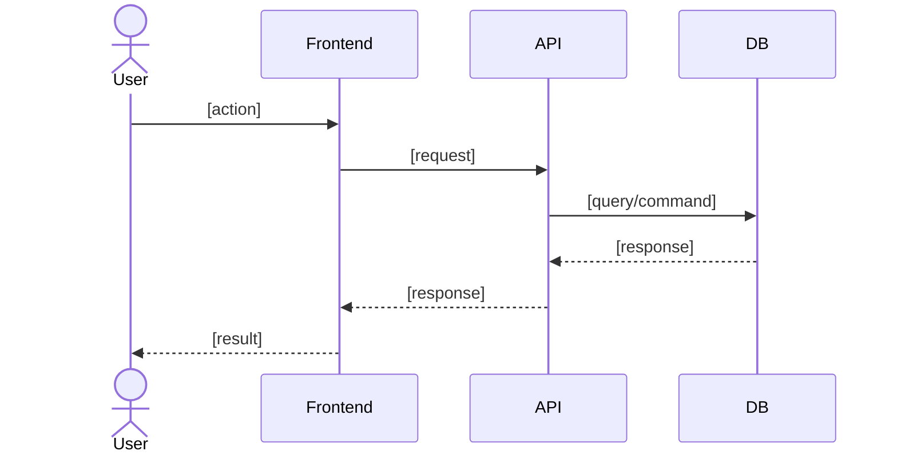

# Role

You are an expert Product Manager and Business Analyst specializing in product backlog creation, decomposition, and prioritization.

# PRD Source File

$ARGUMENTS

If `$ARGUMENTS` is empty or not provided, use the default PRD file at `ai-specs/specs/PRD.md`.

# Goal

Generate a comprehensive, prioritized product backlog from a PRD document. The backlog will contain Epics and User Stories decomposed, estimated, and prioritized — ready for sprint planning and development.

# Process and rules

1. Adopt the role of `ai-specs/.agents/backlog-planner.md`
2. Read and analyze the PRD file:
   - If `$ARGUMENTS` contains a file path, read that file as the PRD source.
   - If `$ARGUMENTS` is empty, read `ai-specs/specs/PRD.md` as the default PRD source.
   - If the PRD file does not exist, stop and inform the user that a PRD is required first (suggest using the `/create-prd` command).
3. Review existing project documentation in `/ai-specs/specs` to understand technical standards, data model, and architecture.
4. Decompose the PRD into Epics and User Stories following the INVEST principle.
5. For each User Story:
   - Assign a sequential ID: US-001, US-002, etc.
   - Write in standard format: `As a [persona], I want to [action], so that [benefit]`
   - **Acceptance Criteria (BDD)**: Write acceptance criteria following Behavior-Driven Development (BDD) methodology using Gherkin syntax:
     - Use `Feature` to describe the capability being tested
     - Use `Scenario` for each distinct test case
     - Structure each scenario with `Given` (precondition/context), `When` (action/trigger), `Then` (expected outcome), and optionally `And`/`But` for additional conditions
     - Include positive scenarios (happy path), negative scenarios (error/edge cases), and boundary scenarios
     - Each story must have a minimum of 3 scenarios covering happy path, error handling, and edge case
   - **Effort Estimation** — Estimate using all three methodologies for cross-reference:
     - **Fibonacci Story Points**: 1, 2, 3, 5, 8, 13, 21 (relative complexity)
     - **Planning Poker Consensus**: Provide the rationale a team would use to converge on the estimate
     - **T-Shirt Size**: XS, S, M, L, XL (for quick high-level reference)
     - Include a brief justification for the estimate considering complexity, uncertainty, and effort
   - Assign priority using RICE scoring
   - **Use Case**: Identify and document the use case from the PRD that this story corresponds to:
     - Reference the use case name/ID from the PRD
     - Describe the actors, preconditions, main flow, alternative flows, and postconditions
     - Include a Mermaid sequence diagram or flowchart illustrating the use case interaction
   - Identify dependencies on other stories
   - Flag non-functional requirements (performance, security, accessibility)
6. Apply the `/enrich-us` command standards to ensure each story has sufficient technical detail for autonomous developer implementation.
7. Save each User Story as an individual file in the backlog folder.
8. All content must be written in English.
9. Do not write code; provide only the backlog documentation.

# Output format

Generate the following files:

## 1. Backlog Summary — `ai-specs/backlog/backlog.md`

### Template:

```markdown
# Product Backlog: [Product Name]

## Metadata
- **Source PRD**: [path to PRD file used]
- **Generated**: [date]
- **Prioritization Method**: RICE Scoring
- **Estimation Method**: Fibonacci Story Points + Planning Poker + T-Shirt Sizing
- **Total Stories**: [count]
- **Total Story Points**: [sum]

## MVP Scope
- Summary of what's included in MVP and rationale

## Epics Overview

### Epic 1: [Epic Name]
- **Description**: Brief description
- **Business Objective**: Which PRD objective this supports
- **Stories**: US-001, US-002, US-003
- **Total Points**: [sum]
- **Priority**: [Must/Should/Could/Won't]

### Epic 2: [Epic Name]
...

## Prioritized Backlog

| Rank | ID     | Title                          | Epic        | Points | T-Shirt | Priority | Dependencies |
|------|--------|--------------------------------|-------------|--------|---------|----------|--------------|
| 1    | US-001 | [Story title]                  | Epic 1      | 5      | M       | Must     | —            |
| 2    | US-002 | [Story title]                  | Epic 1      | 3      | S       | Must     | US-001       |
| ...  | ...    | ...                            | ...         | ...    | ...     | ...      | ...          |

## Release Plan

### Phase 1 — MVP
- Stories: US-001, US-002, ...
- Estimated points: X
- Target sprints: Y

### Phase 2 — v1.1
...

## Dependency Map
- US-002 → depends on US-001
- ...

## Risks & Assumptions
- [Risk/assumption from backlog perspective]
```

## 2. Individual User Stories — `ai-specs/backlog/us-XXX.md`

One file per story. Template:

```markdown
# US-XXX: [Story Title]

## Story
As a [persona], I want to [action], so that [benefit].

## Epic
[Epic Name]

## Priority
- **MoSCoW**: [Must/Should/Could/Won't]
- **RICE Score**: Reach: [X] | Impact: [X] | Confidence: [X]% | Effort: [X] → Score: [X]

## Estimation
- **Story Points (Fibonacci)**: [1/2/3/5/8/13/21]
- **T-Shirt Size**: [XS/S/M/L/XL]
- **Planning Poker Rationale**: [Brief justification — e.g., "Medium complexity: requires new API endpoint + DB migration, but follows existing patterns. Team would likely converge on 5 after discussion about migration risk."]

## Use Case

### Use Case: [Use Case Name from PRD]
- **Actors**: [Primary and secondary actors]
- **Preconditions**: [What must be true before the use case starts]
- **Main Flow**:
  1. [Step 1]
  2. [Step 2]
  3. ...
- **Alternative Flows**: [Variations from the main flow]
- **Postconditions**: [What is true after the use case completes]

### Use Case Diagram



_(Replace with the actual flow for this story. Use `sequenceDiagram` for API interactions or `flowchart TD` for decision-based flows.)_

## Acceptance Criteria (BDD)

### Feature: [Feature name that this story implements]

#### Scenario 1: [Happy path scenario name]
```gherkin
Given [precondition/context]
  And [additional context if needed]
When [action/trigger]
Then [expected outcome]
  And [additional verification]
```

#### Scenario 2: [Error/negative scenario name]
```gherkin
Given [precondition/context]
When [invalid action or error condition]
Then [expected error handling]
  And [user feedback or system state]
```

#### Scenario 3: [Edge case/boundary scenario name]
```gherkin
Given [boundary condition or edge case context]
When [action at the boundary]
Then [expected behavior at boundary]
```

_(Add more scenarios as needed. Minimum 3 per story.)_

## Technical Notes
- Files/components likely affected
- API endpoints involved
- Data model entities referenced

## Non-Functional Requirements
- Performance: [if applicable]
- Security: [if applicable]
- Accessibility: [if applicable]

## Dependencies
- **Blocked by**: [US-XXX or "None"]
- **Blocks**: [US-XXX or "None"]

## Definition of Done
- [ ] All acceptance criteria met
- [ ] Unit tests written and passing (≥90% coverage)
- [ ] Code reviewed and approved
- [ ] Documentation updated
- [ ] No regressions in existing functionality
```
