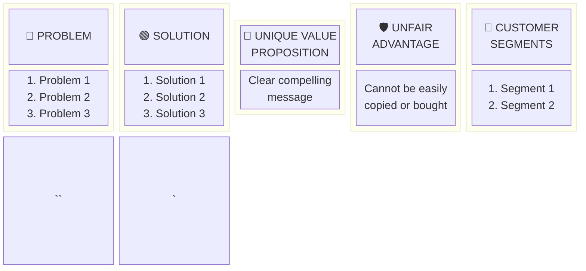

# Role

You are an elite software architect and visual documentation specialist, expert at producing precise technical and business diagrams using Mermaid syntax.

# PRD / Context Source File

$ARGUMENTS

If `$ARGUMENTS` is empty or not provided, scan the workspace for the PRD at `ai-specs/specs/PRD.md` and supporting docs in `ai-specs/specs/` (data-model.md, api-spec.yml, etc.).

# Goal

Generate a complete set of project diagrams that visually document the system from multiple perspectives: business model, user interactions, system architecture, data relationships, and runtime behaviour. Each diagram type is saved as a separate file inside the `ai-specs/diagrams/` folder.

# Process and rules

1. Adopt the role of `ai-specs/.agents/diagram-architect.md`
2. Read and analyze the source documentation:
   - If `$ARGUMENTS` contains a file path, read that file as the primary source.
   - If `$ARGUMENTS` is empty, read `ai-specs/specs/PRD.md` as the primary source.
   - Additionally read all supporting files in `ai-specs/specs/` (data-model.md, api-spec.yml, backend-standards.mdc, frontend-standards.mdc) for technical context.
   - If the backlog exists at `ai-specs/backlog/backlog.md`, read it for user stories context.
   - If no PRD exists, stop and inform the user to create one first (suggest `/create-prd`).
3. Create the `ai-specs/diagrams/` folder if it does not exist.
4. Generate each diagram type as a separate Markdown file containing:
   - A brief explanation of the diagram (2-3 sentences)
   - The Mermaid diagram code block
   - Notes on assumptions or areas needing validation
5. Cross-validate all diagrams against the source documentation to ensure consistency:
   - Entity names must match across ER, C4, and sequence diagrams
   - API endpoints in sequence diagrams must match `api-spec.yml`
   - Use cases must trace to PRD features
6. All content must be written in English.
7. Do not write application code; produce only diagram documentation.

# Output format

Generate the following files inside `ai-specs/diagrams/`:

---

## 1. Use Case Diagram — `ai-specs/diagrams/use-cases.md`

```markdown
# Use Case Diagram: [Product Name]

## Overview
Brief description of actors and system boundaries.

## Actors
- **[Actor 1]**: Description
- **[Actor 2]**: Description
- **[External System]**: Description

## Use Case Diagram

```mermaid
flowchart LR
    subgraph System ["[Product Name]"]
        UC1([Create Job Position])
        UC2([Review Applications])
        UC3([Schedule Interview])
        UC4([Generate Reports])
        ...
    end

    Recruiter((Recruiter)) --> UC1
    Recruiter --> UC2
    HiringManager((Hiring Manager)) --> UC3
    Admin((Administrator)) --> UC4

    UC3 -.->|<<include>>| UC2
    UC4 -.->|<<extend>>| UC2
`` `

## Use Case Descriptions

### UC1: [Use Case Name]
- **Actor**: [Primary actor]
- **Preconditions**: [What must be true]
- **Main Flow**: [Step-by-step]
- **Postconditions**: [What is true after]
- **Linked User Stories**: US-001, US-002
```

---

## 2. Sequence Diagrams — `ai-specs/diagrams/sequence-diagrams.md`

One sequence diagram per major flow (authentication, CRUD operations, key business processes).

```markdown
# Sequence Diagrams: [Product Name]

## 1. [Flow Name] (e.g., "User Authentication Flow")

Brief description of the interaction.

```mermaid
sequenceDiagram
    actor User
    participant Frontend
    participant API
    participant AuthService
    participant DB

    User->>Frontend: Enter credentials
    Frontend->>API: POST /auth/login
    API->>AuthService: validateCredentials(email, password)
    AuthService->>DB: SELECT user WHERE email = ?
    DB-->>AuthService: User record
    alt Valid credentials
        AuthService-->>API: JWT token
        API-->>Frontend: 200 OK { token }
        Frontend-->>User: Redirect to dashboard
    else Invalid credentials
        AuthService-->>API: AuthenticationError
        API-->>Frontend: 401 Unauthorized
        Frontend-->>User: Show error message
    end
`` `

## 2. [Next Flow Name]
...
```

Generate at least one sequence diagram per Epic in the backlog or per major feature in the PRD.

---

## 3. Lean Canvas — `ai-specs/diagrams/lean-canvas.md`

```markdown
# Lean Canvas: [Product Name]

## Overview
Brief description of the business model.

## Lean Canvas

| **Problem** | **Solution** | **Unique Value Proposition** | **Unfair Advantage** | **Customer Segments** |
|---|---|---|---|---|
| 1. [Problem 1] | 1. [Solution 1] | [Single clear compelling message] | [Something that cannot be easily copied] | 1. [Segment 1] |
| 2. [Problem 2] | 2. [Solution 2] | | | 2. [Segment 2] |
| 3. [Problem 3] | 3. [Solution 3] | | | 3. [Segment 3] |

| **Key Metrics** | **Channels** |
|---|---|
| 1. [Metric 1] | 1. [Channel 1] |
| 2. [Metric 2] | 2. [Channel 2] |
| 3. [Metric 3] | 3. [Channel 3] |

| **Cost Structure** | **Revenue Streams** |
|---|---|
| 1. [Cost 1] | 1. [Revenue 1] |
| 2. [Cost 2] | 2. [Revenue 2] |
| 3. [Cost 3] | 3. [Revenue 3] |

## Lean Canvas Diagram



---

## 4. C4 Architecture Diagrams — `ai-specs/diagrams/c4-architecture.md`

```markdown
# C4 Architecture Diagrams: [Product Name]

## Level 1: System Context

Shows the system as a whole and its interactions with external actors and systems.

```mermaid
C4Context
    title System Context Diagram - [Product Name]

    Person(user, "User", "Primary user of the system")
    Person(admin, "Administrator", "Manages system configuration")

    System(system, "[Product Name]", "Main system description")

    System_Ext(email, "Email Service", "Sends notifications")
    System_Ext(auth, "Auth Provider", "External authentication")

    Rel(user, system, "Uses", "HTTPS")
    Rel(admin, system, "Manages", "HTTPS")
    Rel(system, email, "Sends emails via", "SMTP/API")
    Rel(system, auth, "Authenticates via", "OAuth 2.0")
`` `

## Level 2: Container Diagram

Shows the major deployable units and their communication.

```mermaid
C4Container
    title Container Diagram - [Product Name]

    Person(user, "User", "Primary user")

    System_Boundary(system, "[Product Name]") {
        Container(frontend, "Frontend App", "React", "Single Page Application")
        Container(api, "Backend API", "Node.js / Express", "REST API")
        ContainerDb(db, "Database", "PostgreSQL", "Stores application data")
    }

    Rel(user, frontend, "Uses", "HTTPS")
    Rel(frontend, api, "Calls", "REST/JSON")
    Rel(api, db, "Reads/Writes", "Prisma/SQL")
`` `

## Level 3: Component Diagram

Shows internal components of a selected container (typically the Backend API).

```mermaid
C4Component
    title Component Diagram - Backend API

    Container_Boundary(api, "Backend API") {
        Component(controllers, "Controllers", "Express", "HTTP request handling")
        Component(services, "Application Services", "TypeScript", "Business logic orchestration")
        Component(domain, "Domain Models", "TypeScript", "Entities and business rules")
        Component(repos, "Repositories", "Prisma", "Data access layer")
        Component(validators, "Validators", "TypeScript", "Input validation")
    }

    Rel(controllers, validators, "Validates input via")
    Rel(controllers, services, "Delegates to")
    Rel(services, domain, "Uses")
    Rel(domain, repos, "Persists via")
`` `
```

---

## 5. Entity-Relationship Diagram — `ai-specs/diagrams/entity-relationship.md`

```markdown
# Entity-Relationship Diagram: [Product Name]

## Overview
Description of the data model and key entities.

## ER Diagram

```mermaid
erDiagram
    ENTITY_A {
        int id PK
        string name
        datetime created_at
        datetime updated_at
    }
    ENTITY_B {
        int id PK
        int entity_a_id FK
        string status
        text description
    }

    ENTITY_A ||--o{ ENTITY_B : "has many"
`` `

## Entity Descriptions

### ENTITY_A
- **Description**: [What this entity represents]
- **Key Fields**: [Notable fields and their purpose]
- **Relationships**: [How it connects to other entities]
- **Constraints**: [Unique, not null, validation rules]

### ENTITY_B
...

## Data Validation Rules
- [Rule 1]
- [Rule 2]

## Notes
- [Assumptions about the data model]
```

---

# Consistency Checklist

After generating all diagrams, verify:
- [ ] All entities in ER diagram match `data-model.md`
- [ ] All API endpoints in sequence diagrams match `api-spec.yml`
- [ ] All C4 containers reflect the actual tech stack from project standards
- [ ] All use cases map to PRD features or backlog user stories
- [ ] Lean Canvas aligns with PRD vision and personas
- [ ] Naming is consistent across all diagram files
- [ ] All Mermaid blocks render without syntax errors
