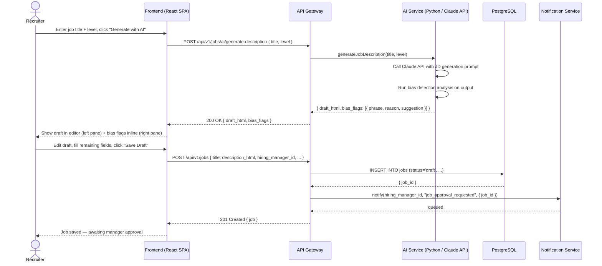

# US-001: AI Job Description Generator

## Story
As a Recruiter, I want AI to generate a draft job description from a role title, so that I can reduce drafting time by 70%.

## Epic
E-02: Job Management & AI-Assisted Creation

## Priority
- **MoSCoW**: Must Have
- **RICE Score**: Reach: 10 | Impact: 5 | Confidence: 96% | Effort: 5.2 → Score: **9.6**

## Estimation
- **Story Points (Fibonacci)**: 8
- **T-Shirt Size**: L
- **Planning Poker Rationale**: The Claude API call and prompt engineering are straightforward, but the story also covers bias detection (inline flag rendering in a split-pane editor UI), the job form save flow, and Hiring Manager approval notification. Team would converge on 8: more than a simple API call, less than a full pipeline feature.

---

## Use Case

### Use Case: UC-01 & UC-02 — Create Job + AI Generate Job Description
- **Actors**: Recruiter (primary), AI System (automated), Hiring Manager (notified)
- **Preconditions**: Recruiter is authenticated with role `recruiter` or higher; job requisition is internally approved
- **Main Flow**:
  1. Recruiter opens "New Job" from the dashboard
  2. Recruiter enters job title and seniority level; clicks "Generate with AI"
  3. System calls AI Service → Claude API generates a structured JD draft (summary, responsibilities, requirements, nice-to-haves)
  4. Bias detection analysis runs on the draft; flagged phrases are highlighted inline
  5. Recruiter edits draft in the split-pane editor; bias flags update in real time
  6. Recruiter fills remaining fields (location, salary range, tags) and clicks "Save as Draft"
  7. System saves the job with `status = draft` and notifies the assigned Hiring Manager for approval
- **Alternative Flows**: Recruiter ignores AI draft and types description manually — bias detection still runs on save
- **Postconditions**: Job record exists with `status = draft`; Hiring Manager has received an in-app + email notification

### Use Case Diagram



---

## Acceptance Criteria (BDD)

### Feature: AI Job Description Generator

#### Scenario 1: Recruiter generates a JD draft from a job title
```gherkin
Given a recruiter is authenticated and on the "New Job" page
When they enter title "Senior Backend Engineer" and level "Senior"
  And click "Generate with AI"
Then the API calls POST /api/v1/jobs/ai/generate-description
  And the response is returned within 3 seconds (p99 < 8s)
  And the response contains draft_html with sections: summary, responsibilities, requirements, nice-to-haves
  And the draft is displayed in the left editor pane
```

#### Scenario 2: Bias detection flags are shown inline
```gherkin
Given the AI has generated a job description draft
  And the draft contains the phrase "young and energetic team"
When the draft is rendered in the editor
Then the phrase "young and energetic" is highlighted with a warning flag
  And hovering the flag shows: reason="age-biased language", suggestion="collaborative and dynamic team"
  And the bias flag count badge in the header shows "1 issue"
```

#### Scenario 3: Recruiter saves the job and Hiring Manager is notified
```gherkin
Given a recruiter has edited the AI draft and filled all required fields
  And hiring_manager_id is set to "user-hm-42"
When the recruiter clicks "Save as Draft"
Then POST /api/v1/jobs is called with status "draft"
  And the job is persisted in the database with status = "draft"
  And an in-app notification is created for user-hm-42 with type "job_approval_requested"
  And an email is dispatched to user-hm-42 within 5 minutes
```

#### Scenario 4: Recruiter skips AI generation and types manually — bias detection still runs
```gherkin
Given a recruiter is on the "New Job" page
  And they type a description manually without clicking "Generate with AI"
  And the description contains "native English speaker required"
When they click "Save as Draft"
Then the API runs bias detection on the submitted description_html
  And a warning is returned in the save response: { bias_flags: [{ phrase: "native English speaker", ... }] }
  And the job is saved but the UI shows a "1 bias issue detected" banner
```

#### Scenario 5: AI service is unavailable — graceful degradation
```gherkin
Given the AI Service is returning 503 Service Unavailable
When a recruiter clicks "Generate with AI"
Then the API responds with 503 and { "error": "ai_service_unavailable", "message": "AI generation is temporarily unavailable. You can write the description manually." }
  And the editor pane remains editable for manual input
  And no error is thrown or displayed as a blocking modal
```

#### Scenario 6: Required fields validation on job save
```gherkin
Given a recruiter attempts to save a job with an empty title
When POST /api/v1/jobs is called with { title: "" }
Then the API responds with 400 Bad Request
  And the response body contains { "error": "validation_error", "fields": { "title": "Title is required" } }
  And no job record is created in the database
```

---

## Technical Notes

- **Files/components affected**:
  - New: `src/modules/jobs/jobs.controller.ts` — handles `POST /api/v1/jobs/ai/generate-description` and `POST /api/v1/jobs`
  - New: `src/modules/jobs/jobs.service.ts` — orchestrates AI call, bias check, job creation, notification trigger
  - New: `src/modules/ai/ai-gateway.service.ts` — thin facade calling the Python AI Service synchronously for JD generation
  - New: `src/db/migrations/002_jobs_table.sql` — jobs table creation
  - Frontend: `src/pages/jobs/NewJobPage.tsx` — split-pane editor with bias flag overlay
  - Frontend: `src/components/BiasFlag.tsx` — inline warning tooltip component

- **API endpoints involved**:
  - `POST /api/v1/jobs/ai/generate-description` — synchronous AI call; timeout: 10s
  - `POST /api/v1/jobs` — create job record; also accepts `description_html` for manual entry path; returns `bias_flags[]` in response body (non-blocking)
  - `PATCH /api/v1/jobs/:id` — update draft before approval

- **Data model entities**: `Job` (title, description_html, status='draft', hiring_manager_id, created_by, tags), `Notification`

- **AI Service call**: `POST http://ai-service:8001/generate-jd { "title": "...", "level": "..." }` — returns `{ "draft_html": "...", "bias_flags": [...] }`. Bias detection is part of the same synchronous call to avoid two round-trips. Target: < 3s p50.

---

## Non-Functional Requirements

- **Performance**: AI generation endpoint p50 < 3s, p99 < 8s. Job save endpoint p99 < 500ms.
- **Security**: Only users with role `recruiter`, `hr_director`, or `admin` can call `POST /api/v1/jobs`. Hiring Manager `id` must belong to the same `organization_id` as the requester.
- **Accessibility**: Bias flag tooltips must be keyboard-accessible (Tab to focus, Enter/Space to expand). The split-pane editor must have proper ARIA labels.

---

## Dependencies

- **Blocked by**: US-010 (RBAC — authentication and role enforcement must exist)
- **Blocks**: US-002 (Multi-Channel Publishing — requires a saved job to publish)

---

## Definition of Done

- [ ] All 6 acceptance criteria scenarios pass with automated tests
- [ ] Unit tests for AI gateway service, bias flag parser, and job service (≥ 90% coverage)
- [ ] Integration test: end-to-end flow from "Generate with AI" click to job saved + notification dispatched
- [ ] Bias detection tested with at least 10 known biased phrases (golden dataset)
- [ ] AI generation timeout handled gracefully (no 500 errors; returns actionable message)
- [ ] Code reviewed and approved
- [ ] Documentation updated (API spec, data model)
- [ ] No regressions in auth/RBAC layer

---

## Tracking
- **Platform**: GitHub
- **External ID**: #11
- **URL**: https://github.com/rchamycruz/Ai4Devs-design2-2026-03-Senior/issues/11
- **Project**: [LTI ATS Backlog](https://github.com/users/rchamy/projects/2)
