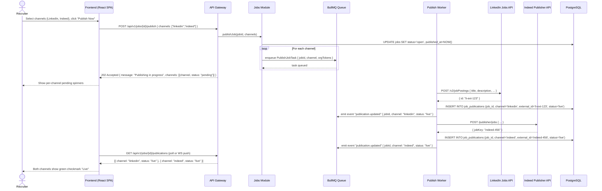

# US-002: Multi-Channel Job Publishing

## Story
As a Recruiter, I want to publish a job to multiple boards in one click, so that I reach more candidates without duplicating effort.

## Epic
E-02: Job Management & AI-Assisted Creation

## Priority
- **MoSCoW**: Must Have
- **RICE Score**: Reach: 9 | Impact: 4 | Confidence: 88% | Effort: 3.8 → Score: **8.4**

## Estimation
- **Story Points (Fibonacci)**: 13
- **T-Shirt Size**: XL
- **Planning Poker Rationale**: Three external API integrations (LinkedIn, Indeed, Glassdoor), each with different auth flows, request schemas, and error models. The async queue pattern adds architectural complexity. UI channel status tracking adds frontend work. Team would converge on 13: every individual piece is tractable, but breadth and integration risk push it above 8.

---

## Use Case

### Use Case: UC-04 — Publish Job to Channels
- **Actors**: Recruiter (primary), Job Board APIs (external systems)
- **Preconditions**: Job has been approved by the Hiring Manager (`status = approved`); organization has connected at least one job board via OAuth in Settings → Integrations
- **Main Flow**:
  1. Recruiter opens the approved job and clicks "Publish"
  2. Channel selector shows available boards with connection status (connected/not connected)
  3. Recruiter selects desired channels and clicks "Publish Now"
  4. System enqueues one async publish task per channel in BullMQ
  5. Workers pick up tasks: each calls the respective job board API, receives an `external_id`, and creates a `JobPublication` record with `status = live`
  6. UI polls or receives WebSocket push for publication status per channel; shows green checkmark per successful channel
  7. Applications submitted via each channel are tagged with the source channel on ingestion
- **Alternative Flows**: One or more channels fail → failed channels show "Retry" button; job remains live on successful channels
- **Postconditions**: `Job.status = open`; one `JobPublication` record per selected channel; source tracking active

### Use Case Diagram



---

## Acceptance Criteria (BDD)

### Feature: Multi-Channel Job Publishing

#### Scenario 1: Recruiter publishes to two channels successfully
```gherkin
Given a job exists with status "approved"
  And the organization has connected LinkedIn and Indeed via OAuth
When a recruiter sends POST /api/v1/jobs/{id}/publish { channels: ["linkedin", "indeed"] }
Then the API responds with 202 Accepted
  And two BullMQ tasks are enqueued (one per channel)
  And within 60 seconds both job_publications records have status "live"
  And job.status is updated to "open"
  And job.published_at is set to the current UTC timestamp
```

#### Scenario 2: Partial failure — one channel fails, the other succeeds
```gherkin
Given a job exists with status "approved"
  And the organization has connected LinkedIn and Indeed
  And the Indeed API is returning 503 Service Unavailable
When the publish job tasks are processed by workers
Then the LinkedIn job_publication record has status "live"
  And the Indeed job_publication record has status "failed"
  And the job.status remains "open" (not rolled back)
  And the UI displays: LinkedIn ✅ "Live" | Indeed ❌ "Failed — Retry"
  And the failed task is retried with exponential backoff (3 attempts max)
```

#### Scenario 3: Source tagging — applications from LinkedIn are tagged correctly
```gherkin
Given a job is live on LinkedIn with external_id "li-ext-123"
When a candidate applies via the LinkedIn apply URL
  And the application webhook is received from LinkedIn
Then the application record is created with source = "linkedin"
  And the application is linked to the correct job_id
```

#### Scenario 4: Recruiter attempts to publish a job not yet approved
```gherkin
Given a job exists with status "draft"
When a recruiter sends POST /api/v1/jobs/{id}/publish { channels: ["linkedin"] }
Then the API responds with 422 Unprocessable Entity
  And the response body contains { "error": "invalid_state", "message": "Job must be approved before publishing" }
  And no publish tasks are enqueued
```

#### Scenario 5: Organization has not connected any job board — channel is disabled in UI
```gherkin
Given an organization has not connected LinkedIn via OAuth
When a recruiter opens the channel selector for publishing
Then LinkedIn appears in the list but is disabled with a badge "Not connected"
  And clicking the disabled LinkedIn option shows a prompt: "Connect LinkedIn in Settings → Integrations"
  And the "Publish Now" button is enabled only if at least one connected channel is selected
```

#### Scenario 6: Career page channel always available without OAuth
```gherkin
Given any organization (regardless of external integrations)
When a recruiter publishes to the "career_page" channel
Then the job is immediately published to the company's LTI-hosted career page
  And a job_publication record is created with channel="career_page" and status="live"
  And no external API call is made
```

---

## Technical Notes

- **Files/components affected**:
  - New: `src/modules/jobs/jobs.controller.ts` — `POST /api/v1/jobs/:id/publish`
  - New: `src/workers/publish-job.worker.ts` — BullMQ worker processing `PublishJobTask`
  - New: `src/integrations/linkedin.adapter.ts` — LinkedIn Jobs API v2 client
  - New: `src/integrations/indeed.adapter.ts` — Indeed Publisher API client
  - New: `src/integrations/glassdoor.adapter.ts` — Glassdoor Employer API client
  - New: `src/db/migrations/003_job_publications.sql` — `job_publications` table
  - Frontend: `src/components/PublishChannelSelector.tsx` — multi-select with connection status badges
  - Frontend: `src/hooks/usePublicationStatus.ts` — polls or subscribes to publication status

- **API endpoints involved**:
  - `POST /api/v1/jobs/:id/publish` — returns `202 Accepted`; async processing via queue
  - `GET /api/v1/jobs/:id/publications` — returns per-channel status for UI polling

- **Data model entities**: `Job` (status transition: `approved → open`), `JobPublication` (one per channel per publish action)

- **Queue design**: Each `PublishJobTask` carries `{ jobId, channel, orgId }`. Workers retrieve org OAuth tokens from DB at execution time (not at enqueue time) to avoid stale token issues. Max 3 retries with exponential backoff (1min → 5min → 15min). After 3 failures, `job_publication.status = failed` and a notification is sent to the recruiter.

- **Webhook ingestion** (prerequisite for source tagging): Job board webhooks (`POST /api/v1/webhooks/applications`) must be implemented as part of this story. Webhooks arrive with the `external_id`; the webhook handler looks up the `JobPublication` to derive `source` and `job_id`.

---

## Non-Functional Requirements

- **Performance**: Publish queue workers should process each channel task within 30s under normal load. UI reflects live status within 60s of initiating publish.
- **Security**: OAuth tokens for job boards are stored encrypted at rest (AES-256) in the database. Token refresh is handled transparently by adapters. Webhook endpoints validate HMAC-SHA256 signatures.
- **Reliability**: Retry logic with exponential backoff (3 attempts); dead-letter queue for permanently failed tasks; recruiter notified on permanent failure.

---

## Dependencies

- **Blocked by**: US-001 (a job must exist with `status = approved`; approval flow is part of US-001)
- **Blocks**: None in MVP

---

## Definition of Done

- [ ] All 6 acceptance criteria scenarios pass with automated tests
- [ ] Unit tests for each job board adapter (mocked HTTP) and the publish worker (≥ 90% coverage)
- [ ] Integration test: end-to-end publish flow with a stubbed LinkedIn API returning a valid `external_id`
- [ ] Webhook handler for inbound applications tested with sample payloads from each provider
- [ ] Retry and dead-letter queue logic verified
- [ ] OAuth token encryption verified in DB
- [ ] Code reviewed and approved
- [ ] Documentation updated (API spec, integration guide per channel)
- [ ] No regressions in job management or RBAC layer

---

## Tracking
- **Platform**: GitHub
- **External ID**: #12
- **URL**: https://github.com/rchamycruz/Ai4Devs-design2-2026-03-Senior/issues/12
- **Project**: [LTI ATS Backlog](https://github.com/users/rchamy/projects/2)
