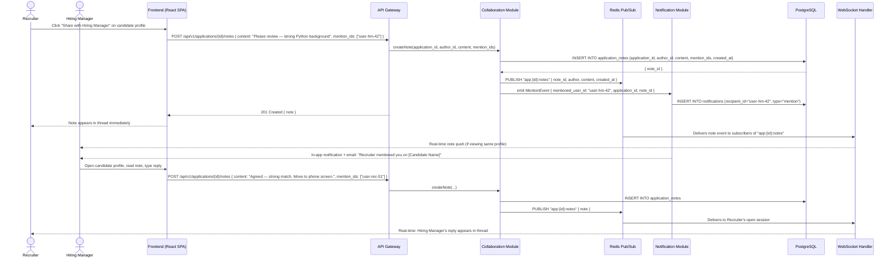

# US-003: Real-Time Collaboration Workspace

## Story
As a Hiring Manager, I want to review candidate profiles and leave comments, so that I can collaborate with the recruiter asynchronously.

## Epic
E-04: Real-Time Collaboration

## Priority
- **MoSCoW**: Must Have
- **RICE Score**: Reach: 9 | Impact: 5 | Confidence: 87% | Effort: 4.7 → Score: **8.7**

## Estimation
- **Story Points (Fibonacci)**: 8
- **T-Shirt Size**: L
- **Planning Poker Rationale**: The core note-creation API is simple, but real-time delivery via WebSocket + Redis pub/sub across multiple API replicas adds meaningful complexity. @mention parsing, notification fanout, and the in-platform activity feed all add scope. Team would converge on 8 — not as complex as scheduling, but more than a simple CRUD feature.

---

## Use Case

### Use Case: UC-07 & UC-08 — Review Candidate Shortlist + Add Collaboration Notes
- **Actors**: Recruiter (primary), Hiring Manager (collaborator)
- **Preconditions**: Applications exist on a job pipeline; both users are authenticated with appropriate roles
- **Main Flow**:
  1. Recruiter opens a candidate profile and clicks "Share with Hiring Manager"
  2. Hiring Manager receives an in-app + email notification with a link to the candidate profile
  3. Hiring Manager opens the shared candidate profile; sees CV, AI score, structured data, and existing notes
  4. Hiring Manager types a comment in the note thread; @mentions the recruiter
  5. Comment is saved and broadcast via WebSocket to all users currently viewing the profile
  6. Recruiter receives an in-app notification for the @mention
  7. Recruiter replies; both parties can see comments in real time without page refresh
- **Alternative Flows**: User is not connected via WebSocket (e.g., email-only) → receives email notification with comment content
- **Postconditions**: All comments are persisted with author attribution and timestamps; visible on the candidate profile activity feed

### Use Case Diagram



---

## Acceptance Criteria (BDD)

### Feature: Real-Time Collaboration Workspace

#### Scenario 1: Note is saved and appears in the thread immediately for the author
```gherkin
Given a recruiter is authenticated and viewing the candidate profile for application "app-001"
When they submit POST /api/v1/applications/app-001/notes { content: "Strong background in Python" }
Then the API responds with 201 Created
  And the note is persisted in application_notes with author_id = recruiter's user_id
  And the note appears in the candidate profile note thread within 500ms
  And the note displays: author full name, avatar, content, and relative timestamp
```

#### Scenario 2: Note is broadcast in real time to other users viewing the same profile
```gherkin
Given a hiring manager is connected via WebSocket and viewing candidate profile "app-001"
  And a recruiter is also viewing the same profile
When the recruiter submits a note on "app-001"
Then the hiring manager's browser receives a WebSocket push event within 1 second
  And the note appears in their thread without a page reload
```

#### Scenario 3: @mention triggers an in-app notification for the mentioned user
```gherkin
Given a recruiter creates a note with content "Please review @marco" and mention_ids: ["user-hm-42"]
When the note is saved
Then an in-app notification is created for user "user-hm-42" with type "mention"
  And an email notification is dispatched to user-hm-42 within 5 minutes
  And the email body includes the note content and a deep link to the candidate profile
```

#### Scenario 4: Hiring Manager without WebSocket receives email fallback
```gherkin
Given a hiring manager is not currently connected via WebSocket (offline)
  And a recruiter @mentions them in a note
When the notification worker processes the mention event
Then the hiring manager receives an email notification with the note content
  And a deep-link URL is included pointing to the specific candidate profile + note anchor
  And no in-app notification is lost (it is stored for when they next log in)
```

#### Scenario 5: Note content cannot be empty
```gherkin
Given a recruiter is authenticated
When they submit POST /api/v1/applications/{id}/notes { content: "" }
Then the API responds with 400 Bad Request
  And the response contains { "error": "validation_error", "fields": { "content": "Note content cannot be empty" } }
  And no note record is created
```

#### Scenario 6: User can only view notes for applications in their organization
```gherkin
Given a hiring manager in "Acme Corp" is authenticated
When they request GET /api/v1/applications/{id}/notes for an application belonging to "Rival Corp"
Then the API responds with 404 Not Found
  And no data from "Rival Corp" is returned
```

---

## Technical Notes

- **Files/components affected**:
  - New: `src/modules/collaboration/collaboration.module.ts` — note creation, @mention parsing, real-time publish
  - New: `src/modules/collaboration/collaboration.controller.ts` — `POST /applications/:id/notes`, `GET /applications/:id/notes`
  - New: `src/ws/ws-gateway.ts` — WebSocket subscription manager (per-application-id rooms)
  - Modified: `src/app.ts` — register WebSocket handler alongside Fastify HTTP server
  - New: `src/db/migrations/006_application_notes.sql` — application_notes table
  - Frontend: `src/components/NoteThread.tsx` — threaded comment display with real-time updates
  - Frontend: `src/hooks/useApplicationNotes.ts` — WebSocket subscription + optimistic UI

- **API endpoints involved**:
  - `POST /api/v1/applications/:id/notes` — create a note; emits real-time event
  - `GET /api/v1/applications/:id/notes` — paginated note history (cursor-based)
  - `WS /ws` — WebSocket connection; clients subscribe to `app:{application_id}:notes` channel after connecting

- **Data model entities**: `ApplicationNote` (application_id, author_id, content, created_at, mention_ids UUID[])

- **Real-time architecture**:
  - After writing to DB, the Collaboration Module publishes to Redis channel `app:{id}:notes`
  - The WS Gateway subscribes to all relevant Redis channels and pushes to connected clients
  - Multiple API replicas each maintain their own WS clients; Redis acts as the cross-replica message bus
  - Fallback: if WebSocket is unavailable (enterprise firewall), the frontend falls back to polling `GET /api/v1/applications/:id/notes` every 10s with `since` timestamp parameter

- **@mention parsing**: The `mention_ids` array is provided by the frontend (the UI resolves @names to user IDs via a type-ahead autocomplete). The backend validates that all `mention_ids` belong to the same organization.

---

## Non-Functional Requirements

- **Performance**: Note save to WebSocket delivery < 1s under normal load. Note thread load (first 20 notes) < 200ms.
- **Security**: WebSocket connections are authenticated via JWT passed as `Authorization` header in the upgrade handshake. Subscription to `app:{id}:notes` is validated against the user's organization.
- **Scalability**: Redis pub/sub ensures real-time delivery across multiple API replicas without sticky sessions.
- **Accessibility**: Note thread must be keyboard-navigable; each note has a unique aria-label with author and timestamp. @mention autocomplete must be operable by keyboard.

---

## Dependencies

- **Blocked by**: US-004 (AI Candidate Ranking — the Pipeline Board and candidate profiles that host the note thread are built in US-004), US-010 (RBAC)
- **Blocks**: US-012 (Mobile Manager View — the note thread must exist before it can be made mobile-responsive)

---

## Definition of Done

- [ ] All 6 acceptance criteria scenarios pass with automated tests
- [ ] Unit tests for @mention parsing and note validation (≥ 90% coverage)
- [ ] Integration test: WebSocket delivery verified with two simulated clients on separate API instances connected via Redis pub/sub
- [ ] Fallback polling mode tested (disable WebSocket, verify 10s poll still delivers notes)
- [ ] Cross-tenant isolation verified for note access
- [ ] @mention notification email verified with correct deep-link URL
- [ ] Code reviewed and approved
- [ ] No regressions in pipeline or notification modules

---

## Tracking
- **Platform**: GitHub
- **External ID**: #15
- **URL**: https://github.com/rchamycruz/Ai4Devs-design2-2026-03-Senior/issues/15
- **Project**: [LTI ATS Backlog](https://github.com/users/rchamy/projects/2)
