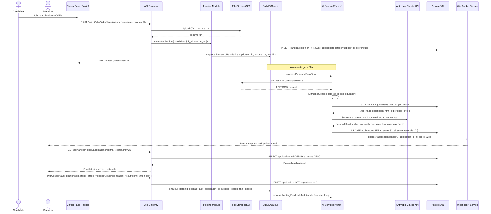

# US-004: AI Candidate Ranking & Shortlisting

## Story
As a Recruiter, I want to see AI-ranked candidate shortlists, so that I can prioritize review of the best-fit applicants.

## Epic
E-03: Candidate Pipeline & AI Ranking

## Priority
- **MoSCoW**: Must Have
- **RICE Score**: Reach: 10 | Impact: 5 | Confidence: 91% | Effort: 5.5 → Score: **9.1**

## Estimation
- **Story Points (Fibonacci)**: 13
- **T-Shirt Size**: XL
- **Planning Poker Rationale**: This story spans two systems: the async CV parsing + AI ranking pipeline (Python AI Service + BullMQ) and the ranked shortlist UI with explainability and override capability. Each part is moderate complexity, but their integration, duplicate detection, and the feedback loop for recruiter overrides push the total to 13.

---

## Use Case

### Use Case: UC-05 & UC-06 — Receive Applications + AI Parse & Rank
- **Actors**: Candidate (submits), AI System (parses/ranks), Recruiter (reviews)
- **Preconditions**: Job is published and accepting applications
- **Main Flow**:
  1. Candidate submits application with CV via the public career page
  2. Application record is created; CV is uploaded to S3; AI parse+rank task is enqueued in BullMQ
  3. AI Service fetches the CV, extracts structured data (skills, experience, education), and scores the candidate against the job requirements using the Claude API
  4. `ai_score` (0–100) and `ai_score_rationale` (JSONB with top matching skills, gaps, and summary) are stored on the Application record
  5. Recruiter opens the Pipeline Board and sees candidates ranked by `ai_score` descending
  6. Each candidate card shows the AI score badge and a "Why?" explainability tooltip
  7. Recruiter can override the ranking by clicking "Move Up" / "Move Down" or directly advancing/rejecting; override reason is logged and feeds back into the AI model
- **Alternative Flows**: Duplicate candidate (same email, different application) → system flags merge suggestion
- **Postconditions**: All applications have `ai_score`; ranked shortlist is visible on Pipeline Board

### Use Case Diagram



---

## Acceptance Criteria (BDD)

### Feature: AI Candidate Ranking & Shortlisting

#### Scenario 1: Application is parsed and ranked within 60 seconds
```gherkin
Given a job is open with requirements including "Python, AWS, 3+ years experience"
  And a candidate submits an application with a CV containing "5 years Python, AWS Certified"
When the application is created
Then within 60 seconds the application has ai_score set (not null)
  And ai_score_rationale contains at least: top_skills[], gaps[], summary string
  And the Pipeline Board updates in real time via WebSocket push
```

#### Scenario 2: Pipeline Board shows candidates ranked by AI score
```gherkin
Given a job has 5 applications with ai_scores: [92, 78, 65, 41, 30]
When a recruiter requests GET /api/v1/jobs/{jobId}/applications?sort=ai_score
Then the API returns applications in descending order: [92, 78, 65, 41, 30]
  And each application includes: ai_score, ai_score_rationale.summary, candidate.full_name
  And each application shows an "AI score" badge in the UI
```

#### Scenario 3: Recruiter can view AI ranking rationale
```gherkin
Given a candidate application with ai_score = 82
  And ai_score_rationale.top_skills = ["Python", "AWS"] and ai_score_rationale.gaps = ["Kubernetes"]
When the recruiter hovers the AI score badge or clicks "Why this score?"
Then a tooltip/panel shows: "Strong match: Python, AWS. Missing: Kubernetes."
  And the summary from ai_score_rationale.summary is displayed
```

#### Scenario 4: Recruiter can override AI ranking — override is logged
```gherkin
Given a candidate with ai_score = 45
  And the recruiter believes the AI undervalued them
When the recruiter manually advances the candidate to stage "phone_screen"
  And provides override_reason: "Strong open source contributions not captured in CV"
Then the application.stage is updated to "phone_screen"
  And an override event is logged: { application_id, original_score: 45, override_reason, recruiter_id }
  And a RankingFeedbackTask is enqueued for the AI model
```

#### Scenario 5: Duplicate candidate detection
```gherkin
Given candidate with email "jane@example.com" has an existing application for job "Backend Engineer" (application_id: "app-111")
When the same candidate applies again for "Backend Engineer" with the same email
Then the API responds with 409 Conflict
  And the response contains { "error": "duplicate_application", "existing_application_id": "app-111" }
  And no new application record is created
```

#### Scenario 6: AI Service unavailable — application saved, ranking deferred
```gherkin
Given the AI Service queue is temporarily down
When a candidate submits an application
Then the application is created with ai_score = null and stage = "applied"
  And the parse+rank task remains in the queue
  And when the AI Service recovers, the task is processed and ai_score is populated
  And no data is lost
```

---

## Technical Notes

- **Files/components affected**:
  - New: `src/modules/pipeline/pipeline.controller.ts` — `POST /api/v1/jobs/:jobId/applications`, `PATCH /api/v1/applications/:id/stage`
  - New: `src/modules/pipeline/pipeline.service.ts` — application lifecycle, duplicate detection, state machine
  - New: `src/workers/parse-rank.worker.ts` — BullMQ worker; calls AI Service HTTP endpoint
  - New: `ai-service/handlers/parse_rank.py` — FastAPI endpoint calling Claude API for CV extraction + scoring
  - New: `src/db/migrations/004_applications_candidates.sql` — applications, candidates tables
  - Frontend: `src/pages/jobs/PipelineBoard.tsx` — Kanban view with AI score badges
  - Frontend: `src/components/CandidateCard.tsx` — card with score badge + "Why?" tooltip

- **API endpoints involved**:
  - `POST /api/v1/jobs/:jobId/applications` — public (no auth); creates application + enqueues rank task
  - `GET /api/v1/jobs/:jobId/applications` — requires auth; supports `?sort=ai_score&limit=&offset=`
  - `GET /api/v1/applications/:id` — full profile including ai_score_rationale
  - `PATCH /api/v1/applications/:id/stage` — stage transition + optional override_reason

- **Data model entities**: `Application` (ai_score, ai_score_rationale, stage), `Candidate`, S3 for resumes

- **AI scoring prompt design**: The Claude API is called with a structured extraction prompt that receives the job description + requirements as context and the extracted CV text. Output is constrained to JSON schema: `{ score: 0-100, top_skills: string[], gaps: string[], summary: string }`. Temperature: 0.2 for consistency.

- **State machine**: Valid stage transitions enforced in `pipeline.service.ts`:
  `applied → screening → phone_screen → assessment → interview → offer → hired | rejected | withdrawn`
  Direct jumps (e.g., `applied → hired`) return `422 Invalid State Transition`.

---

## Non-Functional Requirements

- **Performance**: CV parsing + ranking completed within 60s (p95). Queue depth alert triggers if > 500 pending tasks.
- **Security**: CV files in S3 accessed only via time-limited pre-signed URLs (TTL: 15 minutes). AI Service is internal-only (no public endpoint); accessed via internal DNS.
- **Privacy**: GDPR — AI processing is only triggered if `candidate.gdpr_consent_at` is not null. CV text is not stored outside S3 and PostgreSQL; not sent to third parties beyond Anthropic.
- **Accessibility**: AI score badge meets 4.5:1 color contrast ratio. Rationale tooltip is keyboard-accessible.

---

## Dependencies

- **Blocked by**: US-010 (RBAC — application creation endpoint needs GDPR consent infrastructure from US-010)
- **Blocks**: US-003 (Collaboration — pipeline board is the context for collaboration), US-005 (Scheduling — requires candidates in the pipeline), US-007 (Analytics — requires application stage event data), US-009 (Screening forms — extend the pipeline)

---

## Definition of Done

- [ ] All 6 acceptance criteria scenarios pass with automated tests
- [ ] AI parsing and ranking latency verified: p95 < 60s under simulated load (50 concurrent CV submissions)
- [ ] Duplicate detection tested with same-email, same-job submissions
- [ ] State machine transitions tested: all valid paths + all invalid jump rejections
- [ ] GDPR consent gate verified: ranking task is NOT enqueued if gdpr_consent_at is null
- [ ] Override feedback task verified to enqueue on manual stage advancement
- [ ] Code reviewed and approved
- [ ] AI scoring prompt reviewed for bias and accuracy against a golden test set of 20 CVs
- [ ] No regressions in auth or job management
