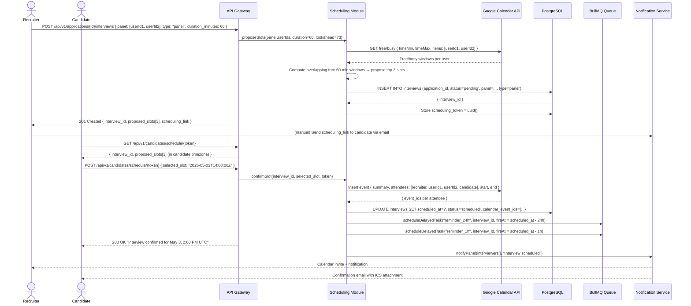

# US-005: Automated Interview Scheduling

## Story
As a Recruiter, I want the system to propose available interview slots from panel calendars, so that I can eliminate back-and-forth scheduling.

## Epic
E-05: Interview Scheduling & Scorecards

## Priority
- **MoSCoW**: Must Have
- **RICE Score**: Reach: 9 | Impact: 5 | Confidence: 89% | Effort: 4.5 → Score: **8.9**

## Estimation
- **Story Points (Fibonacci)**: 13
- **T-Shirt Size**: XL
- **Planning Poker Rationale**: This story spans calendar OAuth integration (Google first, Outlook deferred), overlap detection logic, candidate self-scheduling token flow, calendar event creation for multiple attendees, and reminder scheduling. Each piece is tractable, but four distinct integration surfaces and the token-based candidate scheduling page make this firmly 13.

---

## Use Case

### Use Case: UC-12 & UC-13 — Schedule Interview + Candidate Self-Scheduling
- **Actors**: Recruiter (initiates), Candidate (self-schedules), Panel members (calendar owners)
- **Preconditions**: Candidate has passed screening; interview panel members are defined; panel members have connected their Google Calendar via OAuth in Settings
- **Main Flow**:
  1. Recruiter selects the candidate and clicks "Schedule Interview"; selects panel members and interview type
  2. System calls Google Calendar free/busy API for all panel members over the next 7 days
  3. System computes overlapping 60-minute windows and proposes ≥ 3 time slots
  4. Recruiter sends the self-scheduling link (token-authenticated URL) to the candidate
  5. Candidate opens the link, views 3 time slots in their timezone, and selects one
  6. System creates calendar events for recruiter, all panel members, and candidate
  7. System queues reminder notifications at T-24h and T-1h for all parties
  8. All parties receive calendar invites
- **Alternative Flows**: Candidate reschedules → system re-queries availability and regenerates slots
- **Postconditions**: `Interview.status = scheduled`; calendar events created; reminders queued

### Use Case Diagram



---

## Acceptance Criteria (BDD)

### Feature: Automated Interview Scheduling

#### Scenario 1: System proposes 3 non-overlapping slots from panel availability
```gherkin
Given a panel of two users has the following availability next 7 days:
  - user-1: free Mon 10:00-12:00, Wed 14:00-16:00
  - user-2: free Mon 10:00-11:30, Wed 14:00-17:00
When a recruiter triggers POST /api/v1/applications/{id}/interviews { panel: [user-1, user-2], duration_minutes: 60 }
Then the API returns exactly 3 proposed_slots
  And each slot is 60 minutes long
  And each slot falls within overlapping free windows for both panelists
  And all slots are in the future (≥ 2 hours from now)
```

#### Scenario 2: Candidate selects a slot and calendar events are created for all parties
```gherkin
Given an interview with scheduling_token "tok-abc123" and proposed_slots: ["2026-05-03T14:00:00Z", ...]
When the candidate sends POST /api/v1/candidates/schedule/tok-abc123 { selected_slot: "2026-05-03T14:00:00Z" }
Then the Google Calendar API is called to create an event with all attendees (recruiter + panel + candidate email)
  And calendar_event_ids are stored on the Interview record for each attendee
  And interview.status is updated to "scheduled"
  And interview.scheduled_at is set to "2026-05-03T14:00:00Z"
  And all panelists receive a calendar invite
```

#### Scenario 3: Reminder notifications are queued at T-24h and T-1h
```gherkin
Given an interview is confirmed for 2026-05-03T14:00:00Z
When the slot is confirmed
Then two BullMQ delayed tasks are enqueued:
  - reminder_24h fires at 2026-05-02T14:00:00Z
  - reminder_1h fires at 2026-05-03T13:00:00Z
When each task fires
  Then notification emails/SMS are dispatched to all interview participants (recruiter, panel, candidate)
```

#### Scenario 4: Scheduling token is single-use and expires after 7 days
```gherkin
Given a scheduling_token was issued 8 days ago
When the candidate sends GET /api/v1/candidates/schedule/{token}
Then the API responds with 410 Gone
  And the response body contains { "error": "scheduling_link_expired", "message": "This scheduling link has expired. Please contact your recruiter." }
```

#### Scenario 5: Candidate reschedules — new slots are generated from updated availability
```gherkin
Given an interview is in status "scheduled" with scheduled_at = "2026-05-03T14:00:00Z"
  And the candidate sends POST /api/v1/candidates/schedule/{token}/reschedule
Then the system re-queries panel availability for the next 7 days
  And returns 3 new proposed_slots (excluding the already-selected slot)
  And the original calendar events are deleted from all attendees' calendars
  And interview.status is set back to "pending"
```

#### Scenario 6: Panel member has not connected Google Calendar — slot proposal falls back to manual
```gherkin
Given a panel member "user-3" has not connected Google Calendar (no OAuth token)
When a recruiter triggers interview scheduling with panel including "user-3"
Then the API returns 207 Multi-Status
  And the response indicates: user-3 availability unavailable — manual slots required
  And the scheduling form is pre-populated with a manual time entry mode for the affected slot
  And the system still creates calendar events for connected panel members when a slot is confirmed
```

---

## Technical Notes

- **Files/components affected**:
  - New: `src/modules/scheduling/scheduling.module.ts` — slot proposal, confirmation, reschedule, token management
  - New: `src/integrations/google-calendar.adapter.ts` — Google Calendar API v3 client (free/busy + event insert/delete)
  - New: `src/workers/interview-reminder.worker.ts` — delayed BullMQ worker for T-24h and T-1h reminders
  - New: `src/db/migrations/007_interviews.sql` — interviews, interviewer_assignments tables
  - Frontend: `src/pages/schedule/SelfSchedulePage.tsx` — public (token-auth) candidate scheduling page, timezone-aware
  - Frontend: `src/pages/jobs/InterviewScheduler.tsx` — recruiter-facing slot proposal panel

- **API endpoints involved**:
  - `POST /api/v1/applications/:id/interviews` — initiate scheduling; returns proposed_slots + scheduling_link
  - `GET /api/v1/candidates/schedule/:token` — public; returns slots in candidate timezone
  - `POST /api/v1/candidates/schedule/:token` — public; confirms slot; creates calendar events
  - `POST /api/v1/candidates/schedule/:token/reschedule` — public; resets scheduling flow
  - `PATCH /api/v1/interviews/:id` — recruiter-side manual override (fallback)

- **Data model entities**: `Interview` (scheduled_at, status, calendar_event_ids, meeting_url), `InterviewerAssignment` (interview_id, user_id, role), new `SchedulingToken` (token, interview_id, expires_at, used_at)

- **Google Calendar integration**:
  - OAuth 2.0 flow set up during org onboarding (Settings → Integrations → Connect Calendar)
  - Access + refresh tokens stored encrypted per user in DB
  - Free/busy API: `POST https://www.googleapis.com/calendar/v3/freeBusy`
  - Event insert: `POST https://www.googleapis.com/calendar/v3/calendars/primary/events`
  - Token refresh handled transparently by the adapter

- **Timezone handling**: All times stored in UTC. The self-scheduling page detects the candidate's browser timezone via `Intl.DateTimeFormat().resolvedOptions().timeZone` and renders slots in local time.

---

## Non-Functional Requirements

- **Performance**: Slot proposal (calendar API calls + overlap computation) < 3s for panels of up to 5 members.
- **Security**: Scheduling tokens are one-time-use, UUID v4, with 7-day TTL. The self-scheduling page requires the token but no other authentication (candidate-facing). Calendar OAuth tokens are encrypted at rest.
- **Reliability**: If calendar event creation fails for one panel member, the interview record is still created as scheduled, and the failure is logged + retried asynchronously. The interview is never silently skipped.

---

## Dependencies

- **Blocked by**: US-004 (Candidate Pipeline — requires candidates in the pipeline to schedule for), US-010 (RBAC)
- **Blocks**: US-006 (Scorecards — scorecards are submitted after the interview that this story creates)

---

## Definition of Done

- [ ] All 6 acceptance criteria scenarios pass with automated tests
- [ ] Unit tests for overlap computation algorithm (≥ 90% coverage including edge cases: no overlap, single panelist, all-day events blocking slots)
- [ ] Integration test: end-to-end flow with stubbed Google Calendar API returning valid free/busy data
- [ ] Token expiry and single-use enforcement verified
- [ ] Reschedule flow verified: old calendar events deleted, new events created
- [ ] Delayed reminder tasks fire at correct times (verified with time-manipulation in tests)
- [ ] Code reviewed and approved
- [ ] No regressions in pipeline or notification modules

---

## Tracking
- **Platform**: GitHub
- **External ID**: #16
- **URL**: https://github.com/rchamycruz/Ai4Devs-design2-2026-03-Senior/issues/16
- **Project**: [LTI ATS Backlog](https://github.com/users/rchamy/projects/2)
