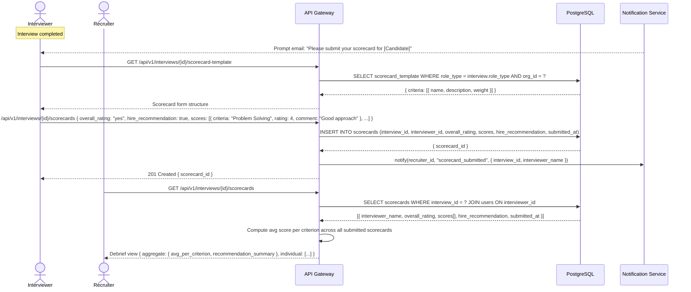

# US-006: Structured Interview Scorecards

## Story
As an Interviewer, I want to submit a structured scorecard after each interview, so that feedback is consistent and actionable.

## Epic
E-05: Interview Scheduling & Scorecards

## Priority
- **MoSCoW**: Must Have
- **RICE Score**: Reach: 8 | Impact: 4 | Confidence: 90% | Effort: 3.5 → Score: **8.2**

## Estimation
- **Story Points (Fibonacci)**: 5
- **T-Shirt Size**: M
- **Planning Poker Rationale**: A form with structured ratings, free-text comments, and an overall recommendation. The main complexity is the configurable template system (different criteria per role type) and the debrief aggregation view. Team would converge on 5 — straightforward CRUD with a moderate UI component.

---

## Use Case

### Use Case: UC-14 & UC-15 — Submit Scorecard + View Debrief
- **Actors**: Interviewer (submits), Recruiter + Hiring Manager (view debrief)
- **Preconditions**: Interview record exists with `status = completed`; the interviewer is assigned to the interview
- **Main Flow**:
  1. After the interview, the interviewer receives an in-app + email prompt to submit their scorecard (triggered by interview status → completed)
  2. Interviewer opens the scorecard form — pre-populated with criteria from the role-type template
  3. Interviewer rates each criterion (1–5 scale) and adds free-text comments
  4. Interviewer selects overall recommendation (strong_yes / yes / neutral / no / strong_no)
  5. Interviewer submits the scorecard
  6. Recruiter and Hiring Manager view the aggregated debrief: average score per criterion, individual ratings, and all recommendations displayed side-by-side
- **Alternative Flows**: Interviewer tries to submit debrief > 24h after interview → system warns but still allows submission
- **Postconditions**: Scorecard is saved; debrief view is updated in real time

### Use Case Diagram



---

## Acceptance Criteria (BDD)

### Feature: Structured Interview Scorecards

#### Scenario 1: Interviewer submits a valid scorecard
```gherkin
Given an interview "int-001" exists with status "completed"
  And user "user-int-42" is assigned as a panelist to "int-001"
  And user "user-int-42" is authenticated
When they send POST /api/v1/interviews/int-001/scorecards { overall_rating: "yes", hire_recommendation: true, scores: [{ criteria: "Technical Skills", rating: 4, comment: "Strong Python" }, { criteria: "Communication", rating: 3, comment: "Clear but verbose" }] }
Then the API responds with 201 Created
  And a Scorecard record is created with submitted_at = current UTC timestamp
  And the recruiter receives an in-app notification: "[Interviewer Name] submitted their scorecard"
```

#### Scenario 2: Debrief view shows aggregated scores across all panelists
```gherkin
Given interview "int-001" has two submitted scorecards:
  - Panelist 1: Technical Skills=4, Communication=3, overall="strong_yes", hire_recommendation=true
  - Panelist 2: Technical Skills=5, Communication=4, overall="yes", hire_recommendation=true
When a recruiter requests GET /api/v1/interviews/int-001/scorecards
Then the response includes aggregate: { "Technical Skills": { avg: 4.5 }, "Communication": { avg: 3.5 } }
  And recommendation_summary: { strong_yes: 1, yes: 1, hire_count: 2, total: 2 }
  And each individual scorecard is listed with interviewer name, ratings, and comments
```

#### Scenario 3: Scorecard template is configurable per role type
```gherkin
Given an HR Director has configured a "Software Engineering" scorecard template with criteria: ["Problem Solving", "Code Quality", "System Design", "Communication"]
When an interviewer opens a scorecard form for an interview linked to a "Software Engineering" role type
Then the scorecard form displays exactly those 4 criteria
  And each criterion has a 1–5 rating slider and a free-text comment field
```

#### Scenario 4: Interviewer cannot submit a second scorecard for the same interview
```gherkin
Given user "user-int-42" has already submitted a scorecard for interview "int-001"
When they attempt to submit POST /api/v1/interviews/int-001/scorecards again
Then the API responds with 409 Conflict
  And the response contains { "error": "scorecard_already_submitted" }
  And no duplicate scorecard is created
```

#### Scenario 5: Scorecard submission requires the interview to be in "completed" status
```gherkin
Given interview "int-002" has status "scheduled" (not yet completed)
When an interviewer submits POST /api/v1/interviews/int-002/scorecards
Then the API responds with 422 Unprocessable Entity
  And the response contains { "error": "invalid_state", "message": "Scorecard can only be submitted after the interview is completed" }
```

#### Scenario 6: Overall rating is a required field
```gherkin
Given an interviewer submits a scorecard without the overall_rating field
When POST /api/v1/interviews/{id}/scorecards is called with { scores: [...], hire_recommendation: true }
Then the API responds with 400 Bad Request
  And the response contains { "error": "validation_error", "fields": { "overall_rating": "Overall rating is required" } }
```

---

## Technical Notes

- **Files/components affected**:
  - New: `src/modules/scorecards/scorecards.controller.ts` — `POST /interviews/:id/scorecards`, `GET /interviews/:id/scorecards`
  - New: `src/modules/scorecards/scorecards.service.ts` — validation, debrief aggregation
  - New: `src/db/migrations/008_scorecards.sql` — scorecards table + scorecard_templates table
  - Frontend: `src/pages/interviews/ScorecardForm.tsx` — dynamic form rendered from template criteria
  - Frontend: `src/pages/interviews/DebriefView.tsx` — side-by-side scorecard comparison with aggregate chart

- **API endpoints involved**:
  - `POST /api/v1/interviews/:id/scorecards` — submit scorecard; enforces unique per (interview_id, interviewer_id)
  - `GET /api/v1/interviews/:id/scorecards` — retrieve all scorecards + computed aggregate for debrief
  - `GET /api/v1/interviews/:id/scorecard-template` — returns the criteria template for the interview's role type
  - `POST /api/v1/scorecard-templates` — HR Director/Admin: create or update a template per role type
  - `GET /api/v1/scorecard-templates` — list configured templates for org

- **Data model entities**: `Scorecard` (interview_id, interviewer_id, overall_rating ENUM, scores JSONB, hire_recommendation BOOLEAN, submitted_at), new `ScorecardTemplate` table (org_id, role_type, criteria JSONB)

- **Debrief aggregation**: Computed at query time (not stored) via `scorecards.service.ts`. Average per criterion is `SUM(rating) / COUNT(scorecards)` for each criterion name. Recommendation summary counts by `overall_rating` value.

- **Scorecard immutability**: `submitted_at` is set server-side; the record cannot be modified after 24 hours (configurable). This enforces the principle that interview feedback must be captured close to the interview, not retroactively altered.

---

## Non-Functional Requirements

- **Performance**: Scorecard save < 200ms. Debrief view load (aggregation query) < 500ms.
- **Security**: Only users assigned to an interview via `InterviewerAssignment` can submit a scorecard for it. Hiring Managers and Recruiters can read scorecards. View-only users cannot.
- **Accessibility**: The 1–5 rating scale must be operable by keyboard (arrow keys). The scorecard form must work fully on mobile (required for US-012). Each rating criterion must have a visible label meeting WCAG 2.1 AA contrast requirements.

---

## Dependencies

- **Blocked by**: US-005 (Interview Scheduling — interviews must exist before scorecards can be submitted)
- **Blocks**: US-012 (Mobile Manager View — the scorecard form must exist and be accessible on mobile)

---

## Definition of Done

- [ ] All 6 acceptance criteria scenarios pass with automated tests
- [ ] Unit tests for debrief aggregation logic with multiple scorecards (≥ 90% coverage)
- [ ] Integration test: submit scorecard → recruiter notification → debrief view reflects new submission
- [ ] Duplicate submission prevention verified with concurrent requests (database unique constraint)
- [ ] Scorecard template system tested: different criteria per role type rendered correctly
- [ ] Code reviewed and approved
- [ ] Scorecard form verified on mobile viewport (375px width)
- [ ] No regressions in interview scheduling or notification modules
