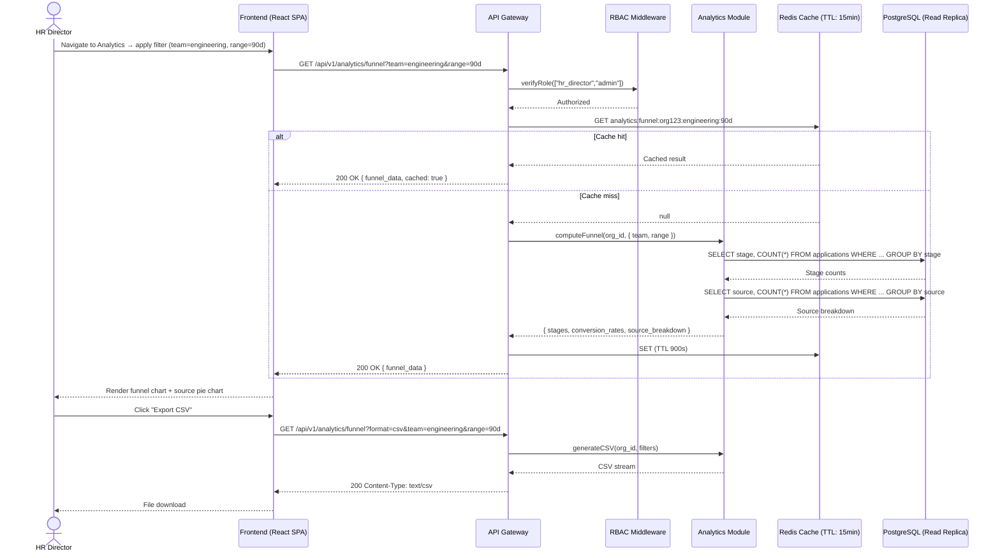

# US-007: HR Analytics Dashboard

## Story
As an HR Director, I want a hiring analytics dashboard, so that I can track time-to-hire, source effectiveness, and diversity metrics.

## Epic
E-08: HR Analytics & Reporting

## Priority
- **MoSCoW**: Should Have
- **RICE Score**: Reach: 7 | Impact: 4 | Confidence: 90% | Effort: 3.5 → Score: **7.2**

## Estimation
- **Story Points (Fibonacci)**: 13
- **T-Shirt Size**: XL
- **Planning Poker Rationale**: Four distinct metric areas (funnel, time-to-hire, source attribution, diversity), each requiring different aggregation queries, a chart visualization layer, filter controls, CSV export, and a read-replica DB setup. The data pipeline is correct but tedious. Team would converge on 13 — no single hard part, but total breadth is wide.

---

## Use Case

### Use Case: UC-17 — View Analytics Dashboard
- **Actors**: HR Director (primary), Admin (secondary)
- **Preconditions**: User has `hr_director` or `admin` role; pipeline event data exists from US-004 and US-005
- **Main Flow**:
  1. HR Director navigates to the Analytics section
  2. Dashboard loads with default view: current quarter, all teams, all roles
  3. Director sees four sections: Hiring Funnel, Time-to-Hire, Source Effectiveness, Diversity Overview
  4. Director applies filters (team, role, date range) — charts update without page reload
  5. Director exports a filtered report as CSV
- **Alternative Flows**: No data yet (new org) → empty state with instructional copy
- **Postconditions**: Data read (no state change); audit log entry written for the access event

### Use Case Diagram



---

## Acceptance Criteria (BDD)

### Feature: HR Analytics Dashboard

#### Scenario 1: Funnel conversion rates are calculated correctly
```gherkin
Given an organization has 100 applications for a job with the following stage distribution:
  applied=100, phone_screen=40, interview=15, offer=5, hired=4
When an HR Director requests GET /api/v1/analytics/funnel
Then the response contains:
  - applied → phone_screen conversion: 40%
  - phone_screen → interview conversion: 37.5%
  - interview → offer conversion: 33.3%
  - offer → hired conversion: 80%
  And total_applications = 100
```

#### Scenario 2: Time-to-hire is calculated as average days from applied_at to hired stage
```gherkin
Given 3 hired applications with days-to-hire: [12, 18, 24]
When GET /api/v1/analytics/time-to-hire is called
Then the response contains avg_days_to_hire = 18
  And median_days = 18
  And the slowest hire is flagged at 24 days
```

#### Scenario 3: Source effectiveness report shows channel attribution
```gherkin
Given applications arrived from: linkedin=50, indeed=30, career_page=15, referral=5
  And 4 hires came from: linkedin=2, indeed=1, career_page=1
When GET /api/v1/analytics/sources is called
Then the response shows source totals + conversion rates per source:
  - linkedin: 50 applications, 2 hires, 4% hire rate
  - indeed: 30 applications, 1 hire, 3.3% hire rate
```

#### Scenario 4: Diversity data is anonymized by default
```gherkin
Given the diversity report endpoint is requested
When GET /api/v1/analytics/diversity is called without the "show_raw" flag
Then the response contains only aggregated counts (e.g., gender distribution percentages)
  And no individual candidate identifiers (name, email, id) are included in the response
```

#### Scenario 5: Dashboard filters update charts without page reload
```gherkin
Given an HR Director is viewing the analytics dashboard
When they change the team filter to "Product" using the filter control
Then the frontend sends a new GET /api/v1/analytics/funnel?team=product request
  And the funnel chart updates within 500ms
  And the URL updates with the new filter parameter (browser history preserved)
```

#### Scenario 6: CSV export returns correct data for applied filters
```gherkin
Given an HR Director has applied filter: range=Q1-2026, team=engineering
When they click "Export CSV"
Then GET /api/v1/analytics/funnel?format=csv&range=Q1-2026&team=engineering is called
  And the response has Content-Type: text/csv
  And the CSV contains headers: stage, count, conversion_rate
  And the data matches what is shown in the dashboard for the same filters
```

---

## Technical Notes

- **Files/components affected**:
  - New: `src/modules/analytics/analytics.controller.ts` — all 4 analytics endpoints
  - New: `src/modules/analytics/analytics.service.ts` — query orchestration + aggregation logic + CSV generation
  - New: `src/db/read-replica.client.ts` — separate Prisma client instance pointing to read replica
  - New: `src/db/migrations/009_analytics_indexes.sql` — covering indexes on (org_id, stage, applied_at, source) for fast aggregation
  - Frontend: `src/pages/analytics/AnalyticsDashboard.tsx` — filter controls + 4 chart panels
  - Frontend: `src/components/charts/FunnelChart.tsx`, `SourcePieChart.tsx`, `TimeToHireChart.tsx`, `DiversityChart.tsx`

- **API endpoints involved**:
  - `GET /api/v1/analytics/funnel?team=&role=&range=&format=` — hiring funnel + conversion rates
  - `GET /api/v1/analytics/time-to-hire?team=&range=` — avg + median + distribution
  - `GET /api/v1/analytics/sources?range=` — source attribution + conversion per source
  - `GET /api/v1/analytics/diversity?range=` — anonymized diversity breakdown

- **Data model entities**: Read from `Application` (stage, source, applied_at), `Job` (title, team tag), `Candidate` (gdpr_consent_at only for filtering). Diversity fields are derived from optional structured data fields on applications (if provided by candidate at time of apply).

- **Caching strategy**: Cache key per endpoint = `analytics:{metric}:{org_id}:{filter_hash}`. TTL: 15 minutes. Cache is invalidated on new hire events (write-through invalidation from Pipeline Module).

- **CSV generation**: Streaming CSV via the Node.js `csv-stringify` library; response is streamed to avoid buffering large result sets in memory.

---

## Non-Functional Requirements

- **Performance**: Dashboard page load < 2s on broadband (including chart render). Analytics API p99 < 1s for standard filter combinations (ensured by covering indexes + 15-min cache).
- **Security**: All analytics endpoints require `hr_director` or `admin` role. Diversity data never includes PII; GDPR-compliant by design.
- **Accessibility**: Charts must have accessible descriptions (ARIA) and data tables as alternative views for screen reader users. Filter controls are keyboard-navigable.

---

## Dependencies

- **Blocked by**: US-004 (AI Candidate Ranking — pipeline stage events), US-005 (Scheduling — time-to-hire completeness), US-008 (Notifications — candidate journey data), US-010 (RBAC)
- **Blocks**: None

---

## Definition of Done

- [ ] All 6 acceptance criteria scenarios pass with automated tests
- [ ] Unit tests for all aggregation functions (funnel conversion, time-to-hire avg/median, source rates, diversity agg) with fixture data (≥ 90% coverage)
- [ ] Integration test: end-to-end from pipeline stage changes → analytics query reflects updated counts
- [ ] Cache hit/miss behavior verified; cache invalidation on hire event verified
- [ ] CSV export tested: correct headers, correct data, correct MIME type
- [ ] Read replica routing verified (no analytics queries hitting primary DB)
- [ ] Diversity endpoint verified to exclude all PII fields
- [ ] Charts render correctly with empty data (new org edge case)
- [ ] Code reviewed and approved
- [ ] No regressions in pipeline, notifications, or RBAC modules

---

## Tracking
- **Platform**: GitHub
- **External ID**: #18
- **URL**: https://github.com/rchamycruz/Ai4Devs-design2-2026-03-Senior/issues/18
- **Project**: [LTI ATS Backlog](https://github.com/users/rchamy/projects/2)
