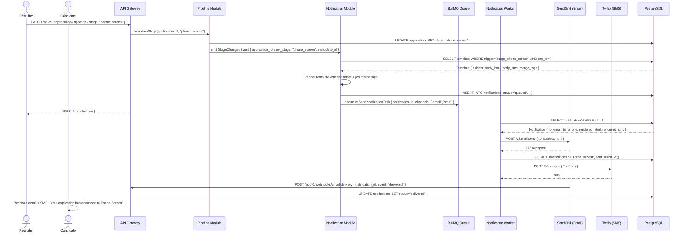

# US-008: Automated Candidate Notifications

## Story
As a Candidate, I want to receive automated status updates at each stage change, so that I am never left wondering about my application.

## Epic
E-06: Candidate Communication & Notifications

## Priority
- **MoSCoW**: Must Have
- **RICE Score**: Reach: 10 | Impact: 5 | Confidence: 90% | Effort: 5.0 → Score: **9.0**

## Estimation
- **Story Points (Fibonacci)**: 5
- **T-Shirt Size**: M
- **Planning Poker Rationale**: Notification dispatch is well-understood: hook into stage transitions (already in the pipeline module), render a template, enqueue to SendGrid/Twilio. The main complexity is the template engine with merge tags and per-company customization. Team would converge on 5 — not trivial but has no novel technical challenges.

---

## Use Case

### Use Case: UC-19 — Receive Status Notifications
- **Actors**: Candidate (recipient), System (trigger on stage change)
- **Preconditions**: Application exists; stage transition event fired by Pipeline Module
- **Main Flow**:
  1. Recruiter advances a candidate to a new stage (e.g., `applied → phone_screen`)
  2. Pipeline Module fires a `stage_changed` domain event
  3. Notification Module receives the event, selects the matching email/SMS template for the new stage
  4. Template is rendered with merge tags: `{{ candidate.full_name }}`, `{{ job.title }}`, `{{ company.name }}`
  5. Notification dispatch task is enqueued in BullMQ
  6. Worker calls SendGrid (email) and/or Twilio (SMS) within 5 minutes of the stage change
  7. `Notification` record is created with `status = sent`; delivery webhook from provider updates it to `delivered`
- **Alternative Flows**: Candidate has opted out of SMS → only email is dispatched
- **Postconditions**: Candidate has received the notification; `Notification.status = delivered`

### Use Case Diagram



---

## Acceptance Criteria (BDD)

### Feature: Automated Candidate Stage-Change Notifications

#### Scenario 1: Candidate receives email within 5 minutes of stage change
```gherkin
Given an application exists with candidate email "jane@example.com"
  And the organization has a template configured for stage "phone_screen"
When a recruiter advances the application to stage "phone_screen"
Then a Notification record is created with status "queued"
  And within 5 minutes the notification worker calls SendGrid with the rendered email
  And the Notification record status updates to "sent"
  And the email subject contains the job title and company name
```

#### Scenario 2: Template renders merge tags correctly
```gherkin
Given a template body contains "Hi {{ candidate.full_name }}, your application for {{ job.title }} at {{ company.name }} has moved to {{ stage.display_name }}."
  And the candidate is "Jane Smith", job is "Senior Engineer", company is "Acme Corp", stage display is "Phone Screen"
When the notification is rendered
Then the rendered email body reads: "Hi Jane Smith, your application for Senior Engineer at Acme Corp has moved to Phone Screen."
  And no unresolved merge tags ({{ ... }}) remain in the rendered output
```

#### Scenario 3: Recruiter can customize a stage template per company
```gherkin
Given an HR Director is authenticated with role "hr_director"
When they send PUT /api/v1/notifications/templates/stage_phone_screen { subject: "...", body_html: "..." }
Then the template is updated for their organization only
  And other organizations' templates are unaffected
  And the next notification for this stage uses the updated template
```

#### Scenario 4: Candidate opted out of SMS — only email is sent
```gherkin
Given a candidate has sms_opt_out = true on their record
When a stage change notification is triggered for them
Then the notification worker calls SendGrid for email
  And the notification worker does NOT call Twilio
  And the Notification record has channel = "email" only
```

#### Scenario 5: Notification dispatch fails — retry logic
```gherkin
Given SendGrid returns 429 Too Many Requests on the first attempt
When the notification worker processes the task
Then the task is retried after 30 seconds
  And retried up to 3 times total
  And after 3 failures the Notification status is set to "failed"
  And an internal alert is logged for the operations team
```

#### Scenario 6: Rejection notification is sent when application is rejected
```gherkin
Given an application is in stage "interview"
When a recruiter advances the stage to "rejected"
Then a notification is dispatched using the "stage_rejected" template
  And the email body contains a respectful rejection message (no ghosting)
  And the candidate receives the email within 5 minutes
```

---

## Technical Notes

- **Files/components affected**:
  - New: `src/modules/notifications/notification.module.ts` — domain event listener + template renderer
  - New: `src/modules/notifications/template.service.ts` — template CRUD + merge tag rendering (Handlebars or similar)
  - New: `src/workers/send-notification.worker.ts` — SendGrid + Twilio dispatch
  - New: `src/db/migrations/005_notifications_templates.sql` — notifications table + notification_templates table
  - New: `src/integrations/sendgrid.adapter.ts` — SendGrid API v3 client
  - New: `src/integrations/twilio.adapter.ts` — Twilio Messages API client
  - Frontend: `src/pages/settings/NotificationTemplates.tsx` — per-org template editor

- **API endpoints involved**:
  - `GET /api/v1/notifications/templates` — list all stage templates for org
  - `PUT /api/v1/notifications/templates/:trigger` — update a stage template
  - `POST /api/v1/webhooks/email-delivery` — SendGrid delivery event webhook (HMAC-validated)

- **Data model entities**: `Notification` (recipient_type, recipient_id, channel, template_id, payload, sent_at, status), new `NotificationTemplate` table (trigger, org_id, subject, body_html, body_sms)

- **Template triggers** (one per stage transition):
  `stage_applied`, `stage_screening`, `stage_phone_screen`, `stage_assessment`, `stage_interview`, `stage_offer`, `stage_hired`, `stage_rejected`, `stage_withdrawn`

- **Default templates**: System ships with a default template per trigger that each org can override. Default templates are read-only and cloned per org on first customization.

---

## Non-Functional Requirements

- **Performance**: Notification dispatch latency < 5 minutes (p95) from stage change event to SendGrid/Twilio call.
- **Security**: SendGrid and Twilio API keys stored in environment variables, never in DB or source code. Delivery webhook endpoints validate provider HMAC signatures.
- **Compliance**: All emails include an unsubscribe link (CAN-SPAM / GDPR compliance). Opt-out is stored on the Candidate record and respected before enqueueing any notification.
- **Accessibility**: Email templates must render correctly in major email clients (Gmail, Outlook, Apple Mail) and meet minimum 4.5:1 color contrast.

---

## Dependencies

- **Blocked by**: US-010 (RBAC — notification template management requires hr_director role enforcement)
- **Blocks**: US-009 (Screening Forms — screening form dispatch reuses the notification infrastructure)

---

## Definition of Done

- [ ] All 6 acceptance criteria scenarios pass with automated tests
- [ ] Unit tests for template rendering covering all merge tags and edge cases (missing values render as empty string, not "undefined")
- [ ] Integration tests: end-to-end from stage change → notification queued → SendGrid mock called within 5 min
- [ ] Opt-out flow verified: SMS not sent to opted-out candidates
- [ ] Retry logic verified: 3 attempts with delays; failure state logged
- [ ] Delivery webhook handler tested with sample SendGrid event payloads
- [ ] Default templates verified for all 9 stage triggers
- [ ] Code reviewed and approved
- [ ] No regressions in pipeline stage transition logic

---

## Tracking
- **Platform**: GitHub
- **External ID**: #14
- **URL**: https://github.com/rchamycruz/Ai4Devs-design2-2026-03-Senior/issues/14
- **Project**: [LTI ATS Backlog](https://github.com/users/rchamy/projects/2)
