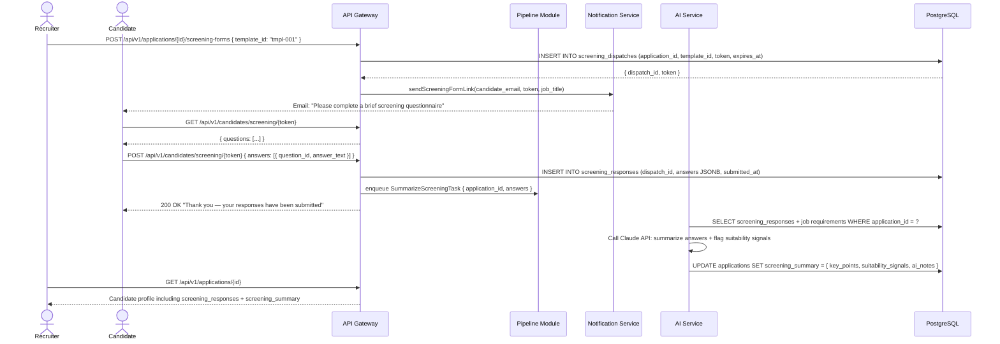

# US-009: Automated Screening Question Forms

## Story
As a Recruiter, I want automated screening question forms dispatched to applicants, so that I can filter candidates without manual outreach.

## Epic
E-03: Candidate Pipeline & AI Ranking

## Priority
- **MoSCoW**: Should Have
- **RICE Score**: Reach: 7 | Impact: 4 | Confidence: 85% | Effort: 3.7 → Score: **6.8**

## Estimation
- **Story Points (Fibonacci)**: 8
- **T-Shirt Size**: L
- **Planning Poker Rationale**: A form builder for recruiters, a public candidate-facing form submission page, response storage, AI summarization of answers, and integration with the notification pipeline. Moderate complexity across frontend and backend, with a non-trivial AI summary call. Team would converge on 8.

---

## Use Case

### Use Case: UC-10 — Dispatch Screening Form
- **Actors**: Recruiter (creates and dispatches), Candidate (completes)
- **Preconditions**: Candidate is in `screening` stage; recruiter has created or selected a screening form template
- **Main Flow**:
  1. Recruiter opens a candidate in the `screening` stage and clicks "Send Screening Form"
  2. Recruiter selects a form template (or creates one inline with 3–10 questions)
  3. System dispatches the form link to the candidate via the notification service
  4. Candidate opens the token-authenticated form page and submits answers
  5. Responses are stored on the Application record
  6. AI generates a summary of the candidate's responses (key points, suitability signals)
  7. Recruiter sees responses + AI summary on the candidate profile
- **Alternative Flows**: Candidate does not respond within 5 days → recruiter receives a reminder prompt
- **Postconditions**: Screening responses and AI summary are visible on the candidate profile; recruiter can advance or reject

### Use Case Diagram



---

## Acceptance Criteria (BDD)

### Feature: Automated Screening Question Forms

#### Scenario 1: Recruiter dispatches a screening form to a candidate
```gherkin
Given a candidate is in stage "screening" for application "app-001"
  And a screening form template "tmpl-eng-01" exists with 5 questions
When a recruiter sends POST /api/v1/applications/app-001/screening-forms { template_id: "tmpl-eng-01" }
Then a screening_dispatch record is created with a unique token and expires_at = now + 5 days
  And the candidate receives an email with the screening form link within 5 minutes
  And the email contains the job title and a call-to-action button
```

#### Scenario 2: Candidate submits screening form responses
```gherkin
Given a valid screening token "tok-scr-xyz" linked to application "app-001"
When the candidate sends POST /api/v1/candidates/screening/tok-scr-xyz with all answers provided
Then the screening_responses record is created with submitted_at = current UTC timestamp
  And the AI summarization task is enqueued
  And the candidate sees a confirmation page: "Thank you — your responses have been submitted"
```

#### Scenario 3: AI-generated summary appears on candidate profile
```gherkin
Given screening responses have been submitted for "app-001"
When the AI summarization task completes
Then the application record has screening_summary populated with:
  - key_points: array of the candidate's main points
  - suitability_signals: positive and negative signals relative to the job
  And the recruiter sees this summary in the "Screening" section of the candidate profile
```

#### Scenario 4: Expired token is rejected
```gherkin
Given a screening token was issued 6 days ago (TTL: 5 days)
When the candidate accesses GET /api/v1/candidates/screening/{expired_token}
Then the API responds with 410 Gone
  And the response contains { "error": "form_link_expired" }
```

#### Scenario 5: Recruiter receives a reminder if no response after 5 days
```gherkin
Given a screening form was dispatched 5 days ago
  And the candidate has not submitted a response
When the scheduled reminder check fires
Then the recruiter receives an in-app notification: "No screening response from [Candidate Name] — consider following up or advancing without screening"
```

#### Scenario 6: Incomplete form submission is rejected
```gherkin
Given a screening form has 5 required questions
When the candidate submits answers for only 3 questions
Then the API responds with 400 Bad Request
  And the response contains { "error": "validation_error", "missing_questions": [4, 5] }
  And no screening_response record is created
```

---

## Technical Notes

- **Files/components affected**:
  - New: `src/modules/screening/screening.controller.ts` — dispatch + public response submission endpoints
  - New: `src/workers/summarize-screening.worker.ts` — BullMQ worker calling AI Service for answer summarization
  - New: `src/db/migrations/010_screening.sql` — screening_form_templates, screening_dispatches, screening_responses tables
  - Frontend: `src/pages/screening/ScreeningFormPage.tsx` — public (token-auth) candidate-facing form
  - Frontend: `src/components/ScreeningResponseViewer.tsx` — recruiter-facing responses + AI summary panel

- **API endpoints involved**:
  - `POST /api/v1/applications/:id/screening-forms` — dispatch form to candidate
  - `GET /api/v1/candidates/screening/:token` — public; returns form questions
  - `POST /api/v1/candidates/screening/:token` — public; submit answers
  - `GET /api/v1/screening-templates` — list org's form templates
  - `POST /api/v1/screening-templates` — create/edit a form template (recruiter+)

- **Data model entities**: New `ScreeningFormTemplate` (org_id, name, questions JSONB), `ScreeningDispatch` (application_id, template_id, token, expires_at, used_at), `ScreeningResponse` (dispatch_id, answers JSONB, submitted_at). `Application` gains `screening_summary JSONB` column.

---

## Non-Functional Requirements

- **Performance**: Form submission < 300ms. AI summarization < 30s (async).
- **Security**: Screening tokens are UUID v4, single-use, 5-day TTL. Form responses are tenant-scoped; no cross-org access.
- **Privacy**: Candidate responses processed by Claude API; subject to GDPR. AI processing requires `gdpr_consent_at` present on Candidate record.

---

## Dependencies

- **Blocked by**: US-004 (Pipeline — candidates must be in screening stage), US-008 (Notifications — uses notification infrastructure for dispatch email), US-010 (RBAC)
- **Blocks**: US-011 (Assessment Integration — assessment dispatch follows the same token pattern)

---

## Definition of Done

- [ ] All 6 acceptance criteria scenarios pass with automated tests
- [ ] Token expiry and single-use enforcement verified
- [ ] AI summary verified with 10 sample answer sets (golden test set)
- [ ] 5-day non-response reminder verified via delayed task
- [ ] Required question validation tested with partial submissions
- [ ] Code reviewed and approved
- [ ] No regressions in pipeline or notification modules
