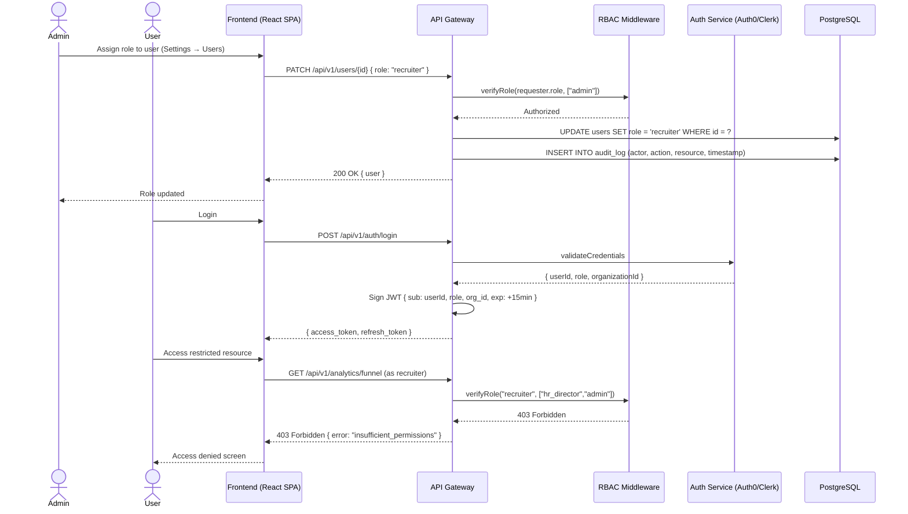

# US-010: Role-Based Access Control (RBAC)

## Story
As an HR Director, I want role-based access control so that sensitive candidate data is only visible to authorized users.

## Epic
E-01: Foundation & Access Control

## Priority
- **MoSCoW**: Must Have
- **RICE Score**: Reach: 10 | Impact: 5 | Confidence: 90% | Effort: 5.8 → Score: **7.8**

## Estimation
- **Story Points (Fibonacci)**: 8
- **T-Shirt Size**: L
- **Planning Poker Rationale**: High-certainty story with well-understood patterns (JWT + RBAC middleware), but breadth is wide: 6 roles to define, API middleware, UI conditional rendering, audit log, and GDPR consent infrastructure all must ship together. Team would likely start at 8 and stay there — no surprises but no shortcuts either.

---

## Use Case

### Use Case: UC-18 — Manage RBAC & Settings
- **Actors**: HR Director (primary), Admin (secondary)
- **Preconditions**: System is deployed; at least one Organization and Admin user exists
- **Main Flow**:
  1. Admin logs in via SSO or email/password
  2. Admin navigates to Settings → Users & Permissions
  3. Admin creates or edits a user record, assigning one of six roles: `admin`, `hr_director`, `recruiter`, `hiring_manager`, `interviewer`, `view_only`
  4. System stores role on the User record and enforces it on every subsequent API call via JWT middleware
  5. System writes an audit log entry for every data access event and every permission change
- **Alternative Flows**: SSO login path — role is derived from IdP group mapping on first login
- **Postconditions**: User can only access resources permitted by their role; all accesses are logged

### Use Case Diagram



---

## Acceptance Criteria (BDD)

### Feature: Role-Based Access Control

#### Scenario 1: Recruiter can access the pipeline board but not analytics
```gherkin
Given a user exists with role "recruiter" in organization "Acme Corp"
  And they are authenticated with a valid JWT
When they request GET /api/v1/analytics/funnel
Then the API responds with 403 Forbidden
  And the response body contains { "error": "insufficient_permissions" }
  And an audit log entry is written with action "ACCESS_DENIED"
```

#### Scenario 2: HR Director can access analytics dashboard
```gherkin
Given a user exists with role "hr_director" in organization "Acme Corp"
  And they are authenticated with a valid JWT
When they request GET /api/v1/analytics/funnel
Then the API responds with 200 OK
  And the response contains funnel data scoped to "Acme Corp" only
  And an audit log entry is written with action "DATA_ACCESS"
```

#### Scenario 3: Admin can promote a user's role
```gherkin
Given an admin user is authenticated
  And a user "user-123" currently has role "recruiter"
When the admin sends PATCH /api/v1/users/user-123 { "role": "hr_director" }
Then the user's role is updated to "hr_director" in the database
  And an audit log entry is created with actor=admin, target=user-123, action="ROLE_CHANGE"
  And the affected user's next JWT refresh reflects the new role
```

#### Scenario 4: Cross-tenant data isolation — recruiter cannot access another organization's data
```gherkin
Given a recruiter in "Acme Corp" (org_id: "org-abc") is authenticated
When they request GET /api/v1/jobs?org_id=org-xyz
Then the API responds with only jobs belonging to "org-abc"
  And no data from "org-xyz" is returned regardless of query parameter manipulation
```

#### Scenario 5: Expired JWT is rejected
```gherkin
Given a user has an access_token that expired 5 minutes ago
  And they have a valid refresh_token
When they send a request with the expired access_token
Then the API responds with 401 Unauthorized
  And the response includes { "error": "token_expired" }
When they send POST /api/v1/auth/refresh { refresh_token }
Then the API responds with a new access_token (15 min TTL)
  And a new refresh_token (7 day TTL, rotating)
```

#### Scenario 6: GDPR consent is recorded on candidate application (infrastructure)
```gherkin
Given a candidate submits an application via the public career page
When the application is created with gdpr_consent: true
Then the database records gdpr_consent_at = current UTC timestamp
  And gdpr_consent_ip = the request IP address
  And no AI processing is triggered until gdpr_consent_at is present on the candidate record
```

---

## Technical Notes

- **Files/components affected**:
  - New: `src/modules/auth/rbac.middleware.ts` — role verification middleware injected into all Fastify route definitions
  - New: `src/modules/auth/jwt.service.ts` — token signing, verification, refresh rotation
  - New: `src/modules/audit/audit.service.ts` — append-only audit log writer
  - New: `src/db/migrations/001_add_rbac_and_audit.sql` — users.role ENUM, audit_log table
  - Modified: All existing route files — add `preHandler: [rbacMiddleware(["role1","role2"])]`
  - Prisma middleware extension for tenant-scoped queries: `src/db/tenant.middleware.ts`

- **API endpoints involved**:
  - `POST /api/v1/auth/login` — credential validation + JWT issuance
  - `POST /api/v1/auth/refresh` — refresh token rotation
  - `POST /api/v1/auth/logout` — refresh token revocation
  - `PATCH /api/v1/users/:id` — role assignment (admin only)
  - `GET /api/v1/users` — user list (admin/hr_director)

- **Data model entities**: `User` (role field), `Organization` (tenant anchor), new `AuditLog` table

- **Role permission matrix**:

  | Resource / Action         | admin | hr_director | recruiter | hiring_manager | interviewer | view_only |
  |--------------------------|-------|-------------|-----------|----------------|-------------|-----------|
  | Create/edit jobs         | ✅    | ✅          | ✅        | ❌             | ❌          | ❌        |
  | View pipeline board      | ✅    | ✅          | ✅        | ✅             | ✅          | ✅        |
  | Move pipeline stage      | ✅    | ✅          | ✅        | ❌             | ❌          | ❌        |
  | Leave notes              | ✅    | ✅          | ✅        | ✅             | ✅          | ❌        |
  | Submit scorecard         | ✅    | ✅          | ✅        | ✅             | ✅          | ❌        |
  | View analytics           | ✅    | ✅          | ❌        | ❌             | ❌          | ❌        |
  | Manage users/RBAC        | ✅    | ❌          | ❌        | ❌             | ❌          | ❌        |

---

## Non-Functional Requirements

- **Security**: JWT access tokens expire in 15 minutes; refresh tokens rotate on use (7-day window); all tokens are revocable via a denylist in Redis. TLS 1.3 required on all connections. Passwords (if not SSO) stored as bcrypt hashes (cost factor 12).
- **Performance**: RBAC middleware adds < 2ms overhead per request (in-memory role check from JWT claims; no DB lookup on hot path).
- **Compliance**: Every data access event writes to `audit_log` within the same DB transaction. Audit log is append-only; no DELETE permitted. Retention: 7 years.
- **Accessibility**: Role management UI must be keyboard-navigable and screen-reader compatible (WCAG 2.1 AA).

---

## Dependencies

- **Blocked by**: None — this is the foundation story
- **Blocks**: US-001, US-002, US-003, US-004, US-005, US-006, US-007, US-008, US-009, US-011, US-012

---

## Definition of Done

- [ ] All acceptance criteria met and verified via automated tests
- [ ] Unit tests for RBAC middleware covering all 6 roles × all permission combinations (≥ 90% coverage)
- [ ] Integration tests: JWT issuance, expiry, refresh rotation, and revocation
- [ ] Cross-tenant isolation tested with dedicated test fixtures
- [ ] GDPR consent field present and enforced on Candidate creation
- [ ] Audit log verified to write on every data access and role change
- [ ] Code reviewed and approved
- [ ] Role permission matrix documented in `/ai-specs/specs/` and matches implementation
- [ ] No regressions in any existing functionality
