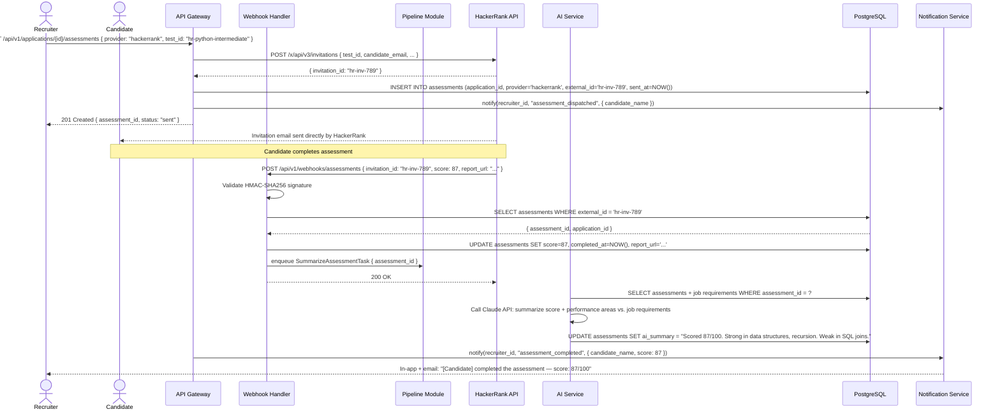

# US-011: Online Assessment Integration

## Story
As a Recruiter, I want to trigger online assessments for shortlisted candidates, so that I can evaluate technical or cognitive skills before interviews.

## Epic
E-07: Assessment Integration

## Priority
- **MoSCoW**: Should Have
- **RICE Score**: Reach: 7 | Impact: 4 | Confidence: 80% | Effort: 3.5 → Score: **6.4**

## Estimation
- **Story Points (Fibonacci)**: 8
- **T-Shirt Size**: L
- **Planning Poker Rationale**: Two provider integrations (HackerRank and Codility), each with their own APIs and webhook schemas, plus result ingestion, AI summarization, and display on the candidate profile. Risk from provider API variability keeps confidence at 80%. Team converges on 8.

---

## Use Case

### Use Case: UC-11 — Dispatch Assessment
- **Actors**: Recruiter (dispatches), Candidate (completes), Assessment Provider (delivers/scores), AI System (summarizes)
- **Preconditions**: Candidate is in `assessment` stage; at least one assessment provider is integrated (Settings → Integrations)
- **Main Flow**:
  1. Recruiter selects a candidate in the `assessment` stage and clicks "Send Assessment"
  2. Recruiter selects assessment type and provider (HackerRank / Codility)
  3. System calls the provider API to create an assessment invitation; receives `external_id`
  4. Provider sends the invitation email directly to the candidate
  5. Candidate completes the assessment on the provider's platform
  6. Provider sends a webhook to LTI with the result payload
  7. System normalizes the score to 0–100, generates an AI summary, and stores the Assessment record
  8. Recruiter sees the result + AI summary on the candidate profile
- **Alternative Flows**: Provider webhook fails → system polls provider API for result every 30 min (up to 48h)
- **Postconditions**: Assessment record persisted; result visible on candidate profile; recruiter can advance or reject

### Use Case Diagram



---

## Acceptance Criteria (BDD)

### Feature: Online Assessment Integration

#### Scenario 1: Recruiter dispatches a HackerRank assessment
```gherkin
Given a candidate is in stage "assessment" for application "app-001"
  And the organization has connected HackerRank via API key in Settings
When a recruiter sends POST /api/v1/applications/app-001/assessments { provider: "hackerrank", test_id: "hr-python-intermediate" }
Then the HackerRank API is called with the candidate's email and test_id
  And an Assessment record is created with provider="hackerrank", external_id set, status="sent"
  And the recruiter receives an in-app notification: "Assessment dispatched to [Candidate Name]"
```

#### Scenario 2: HackerRank webhook delivers result — score is normalized and stored
```gherkin
Given an assessment with external_id "hr-inv-789" exists with status "sent"
When HackerRank sends a webhook POST /api/v1/webhooks/assessments { invitation_id: "hr-inv-789", score: 870, max_score: 1000, report_url: "..." }
Then the webhook handler normalizes: score = (870/1000) × 100 = 87.0
  And the Assessment record is updated: score=87.0, completed_at=now, report_url set
  And a SummarizeAssessmentTask is enqueued
  And the recruiter receives a notification: "Assessment completed — score: 87/100"
```

#### Scenario 3: AI summary is generated and displayed on candidate profile
```gherkin
Given an assessment has score=87 for a "Python Developer" job
When the SummarizeAssessmentTask is processed
Then ai_summary is set to a plain-language interpretation of the score relative to job requirements
  And the recruiter sees the summary in the "Assessment" section of the candidate profile
  And the raw score (87/100) and provider name (HackerRank) are also displayed
```

#### Scenario 4: Webhook signature validation fails — request is rejected
```gherkin
Given HackerRank sends a webhook with an invalid HMAC-SHA256 signature
When POST /api/v1/webhooks/assessments is received
Then the API responds with 401 Unauthorized
  And no assessment record is updated
  And an internal security alert is logged
```

#### Scenario 5: Assessment provider is not connected — error surfaced to recruiter
```gherkin
Given the organization has not connected Codility (no API key configured)
When a recruiter attempts to dispatch a Codility assessment
Then the API responds with 422 Unprocessable Entity
  And the response contains { "error": "provider_not_configured", "message": "Codility is not connected. Configure it in Settings → Integrations." }
```

#### Scenario 6: Webhook not received within 48 hours — polling fallback activates
```gherkin
Given an assessment was dispatched 48 hours ago and no webhook has been received
When the scheduled polling task fires
Then the system calls the HackerRank result API: GET /x/api/v3/invitations/{invitation_id}
  And if a result is available, the Assessment record is updated as in Scenario 2
  And the recruiter is notified of the result
  And if no result, the Assessment status is set to "no_response" and the recruiter is prompted to follow up
```

---

## Technical Notes

- **Files/components affected**:
  - New: `src/modules/assessments/assessments.controller.ts`
  - New: `src/integrations/hackerrank.adapter.ts` — HackerRank X API client
  - New: `src/integrations/codility.adapter.ts` — Codility API client
  - New: `src/workers/summarize-assessment.worker.ts` — AI summary via Claude API
  - New: `src/workers/poll-assessment.worker.ts` — fallback polling worker (48h delayed task)
  - New: `src/db/migrations/011_assessments.sql` — assessments table
  - Frontend: `src/components/AssessmentResultCard.tsx` — score + AI summary + provider report link

- **API endpoints involved**:
  - `POST /api/v1/applications/:id/assessments` — dispatch assessment
  - `POST /api/v1/webhooks/assessments` — inbound result webhook (HMAC-validated, unauthenticated)
  - `GET /api/v1/applications/:id/assessments` — list assessments for a candidate

- **Data model entities**: `Assessment` (application_id, provider ENUM, external_id, sent_at, completed_at, score FLOAT 0-100, report_url, ai_summary)

- **Score normalization**: Each provider adapter is responsible for normalizing its raw score to [0, 100]. Raw scores are stored in the event log for audit; only normalized scores go into the `assessments.score` column.

---

## Non-Functional Requirements

- **Performance**: Webhook handling < 200ms (fast ack to provider). AI summary async; visible within 30s of webhook receipt.
- **Security**: Webhook endpoints validate provider HMAC-SHA256 signatures. API keys for providers stored encrypted in DB, surfaced only to workers at execution time.
- **Reliability**: Fallback polling at 48h ensures no permanent data loss if webhook delivery fails.

---

## Dependencies

- **Blocked by**: US-009 (Screening Forms — token pattern and pipeline stage infrastructure reused), US-010 (RBAC)
- **Blocks**: None

---

## Definition of Done

- [ ] All 6 acceptance criteria scenarios pass with automated tests
- [ ] HMAC signature validation tested with valid and tampered payloads
- [ ] Score normalization logic tested for both providers with sample result payloads
- [ ] AI summary tested with 5 sample assessment result sets
- [ ] 48h polling fallback verified via time-manipulation
- [ ] Provider not-configured error tested
- [ ] Code reviewed and approved
- [ ] No regressions in pipeline or webhook handler modules
