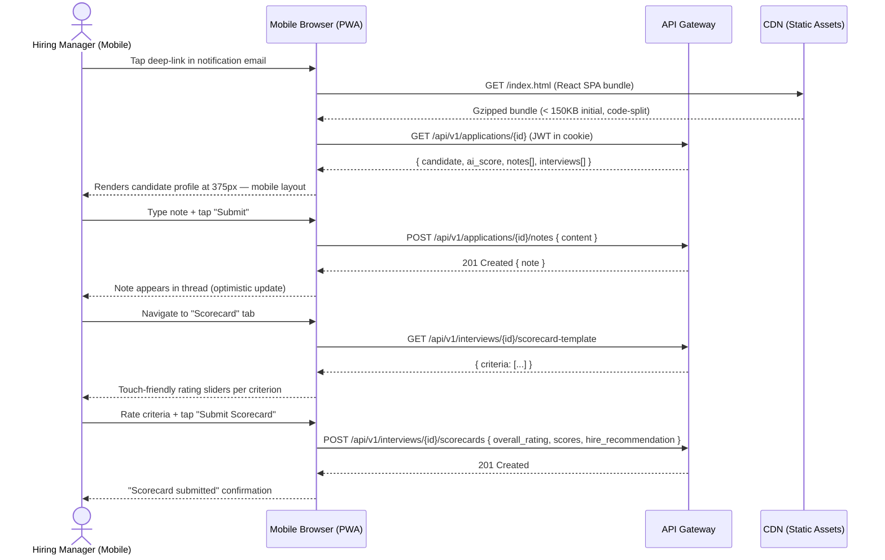

# US-012: Mobile-Friendly Hiring Manager View

## Story
As a Hiring Manager, I want a mobile-friendly candidate review interface, so that I can review profiles and leave feedback from my phone.

## Epic
E-09: Mobile Experience

## Priority
- **MoSCoW**: Should Have
- **RICE Score**: Reach: 8 | Impact: 4 | Confidence: 88% | Effort: 4.0 → Score: **7.0**

## Estimation
- **Story Points (Fibonacci)**: 5
- **T-Shirt Size**: M
- **Planning Poker Rationale**: This is a responsive design and PWA polish story, not a new feature. The core functionality (candidate profile view, note submission, scorecard form) already exists from US-003 and US-006. The work is ensuring it renders correctly on mobile viewports, the scorecard form is operable on touch, and page load meets the 2s target on 4G. Team would converge on 5.

---

## Use Case

### Use Case: UC-07 & UC-14 (Mobile Path) — Review Candidate + Submit Scorecard on Mobile
- **Actors**: Hiring Manager (on mobile device)
- **Preconditions**: Hiring Manager has received an @mention notification on mobile (email or push notification); US-003 and US-006 are implemented
- **Main Flow**:
  1. Hiring Manager taps the deep-link from their notification email on their phone
  2. Browser opens the candidate profile page — fully functional on mobile (375px+ viewport)
  3. Hiring Manager reads the CV summary, AI score, and note thread
  4. Hiring Manager types a note and submits it (touch keyboard)
  5. Hiring Manager navigates to the scorecard form and rates each criterion using touch-friendly sliders
  6. Hiring Manager submits the scorecard with their overall recommendation
- **Alternative Flows**: Manager returns to the session on desktop later — all data is preserved
- **Postconditions**: Note and scorecard are saved identically to the desktop flow

### Use Case Diagram



---

## Acceptance Criteria (BDD)

### Feature: Mobile-Friendly Hiring Manager View

#### Scenario 1: Candidate profile loads within 2 seconds on a 4G connection
```gherkin
Given a hiring manager opens the candidate profile URL on a mobile device with a simulated 4G connection (20 Mbps down, 10ms latency)
When the page is loaded for the first time (no cache)
Then the page is interactive (Largest Contentful Paint) within 2 seconds
  And the candidate name, AI score badge, and note thread are visible without horizontal scrolling
```

#### Scenario 2: Scorecard form is fully operable on a 375px viewport
```gherkin
Given a hiring manager opens the scorecard form on a device with viewport width 375px
When they view the form
Then all criterion labels and rating controls are fully visible without zooming or horizontal scroll
  And rating sliders are operable by touch (touch target ≥ 44px × 44px per WCAG 2.5.5)
  And the "Submit Scorecard" button is visible and reachable without scrolling past 3 screens
```

#### Scenario 3: Note submission works on mobile with touch keyboard
```gherkin
Given a hiring manager is on the candidate profile page on mobile
When they tap the note input field and type a comment using the mobile keyboard
  And tap "Post Note"
Then the note is submitted via POST /api/v1/applications/{id}/notes
  And the note appears in the thread within 500ms (optimistic update)
  And the mobile keyboard does not obscure the "Post Note" button
```

#### Scenario 4: Deep-link from email opens the correct candidate profile
```gherkin
Given a hiring manager receives an @mention email with deep-link "https://app.lti.io/applications/app-001#note-42"
When they tap the link on mobile
Then the browser opens the candidate profile for "app-001"
  And the view scrolls to note "note-42" automatically
  And the hiring manager is prompted to log in if their JWT has expired (not a 500 error)
```

#### Scenario 5: PWA installable on iOS and Android
```gherkin
Given a hiring manager visits the LTI web app on mobile Chrome (Android) or Safari (iOS)
When the browser checks the web app manifest
Then the app is installable as a PWA (manifest.json present with name, icons, start_url, display: standalone)
  And after installation, the app opens without browser chrome
  And offline state shows a graceful "You're offline — some features require an internet connection" screen
```

#### Scenario 6: No regression on desktop — existing layout unaffected
```gherkin
Given the mobile responsive changes are deployed
When an existing recruiter user opens the candidate profile on a 1440px desktop viewport
Then the layout is identical to the pre-change baseline
  And all existing functionality (drag-and-drop pipeline, AI score tooltip, note thread) continues to work
```

---

## Technical Notes

- **Files/components affected**:
  - Modified: `src/pages/candidates/CandidateProfile.tsx` — add responsive breakpoints (Tailwind `sm:`, `md:` prefixes)
  - Modified: `src/components/ScorecardForm.tsx` — replace range input with touch-friendly slider component; increase tap target sizes
  - Modified: `src/components/NoteThread.tsx` — ensure note input stays above keyboard on iOS (use `position: sticky` + `env(keyboard-inset-height)`)
  - New: `public/manifest.json` — PWA web app manifest with icons and `display: standalone`
  - New: `public/sw.js` — Service Worker for offline shell and asset caching
  - Modified: `src/App.tsx` — register service worker

- **API endpoints involved**: No new endpoints. All existing endpoints used by the profile and scorecard pages (US-003, US-006 endpoints).

- **Performance targets**:
  - LCP < 2s on 4G: Achieved via code splitting (`React.lazy`), image optimization (WebP), and CDN-delivered assets
  - JS bundle initial load < 150KB gzipped
  - API calls from mobile: no change to API; JWT in HttpOnly cookie eliminates localStorage access on mobile

- **Touch targets**: All interactive elements (buttons, sliders, links) must meet WCAG 2.5.5: minimum 44×44px touch target size.

---

## Non-Functional Requirements

- **Performance**: LCP < 2s on 4G. Total Blocking Time < 200ms. Cumulative Layout Shift < 0.1.
- **Accessibility**: Full WCAG 2.1 AA compliance on mobile. Focus management verified after keyboard opens/closes.
- **Compatibility**: Tested on: Chrome 120+ (Android), Safari 17+ (iOS 17+), Samsung Internet 24+.

---

## Dependencies

- **Blocked by**: US-003 (Real-Time Collaboration — note thread component must exist), US-006 (Structured Scorecards — scorecard form must exist)
- **Blocks**: None

---

## Definition of Done

- [ ] All 6 acceptance criteria scenarios pass with automated tests
- [ ] Lighthouse mobile audit score ≥ 90 on Performance and Accessibility
- [ ] Manual device testing on iOS Safari (iPhone 14) and Android Chrome (Pixel 7) — all core flows completed without issues
- [ ] Touch target sizes verified for all interactive elements (≥ 44×44px)
- [ ] PWA manifest verified: installable on Android Chrome and iOS Safari
- [ ] Service Worker verified: offline shell renders gracefully
- [ ] Desktop regression tests pass — no layout regressions at 1440px
- [ ] Code reviewed and approved
- [ ] No regressions in candidate profile, note thread, or scorecard form functionality

---

## Tracking
- **Platform**: GitHub
- **External ID**: #21
- **URL**: https://github.com/rchamycruz/Ai4Devs-design2-2026-03-Senior/issues/21
- **Project**: [LTI ATS Backlog](https://github.com/users/rchamy/projects/2)
