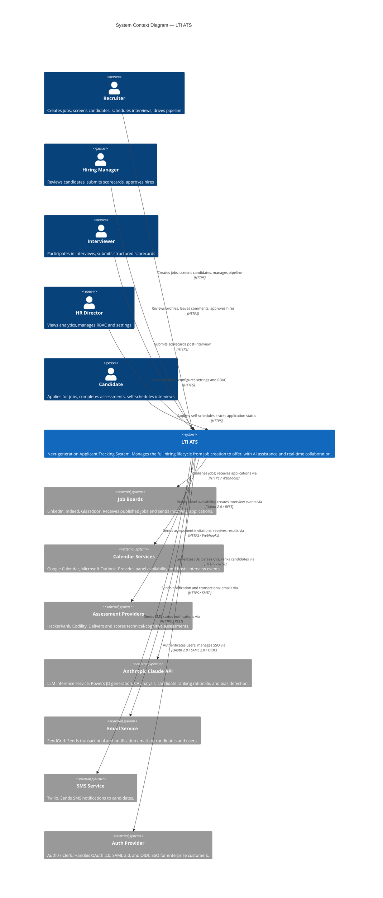
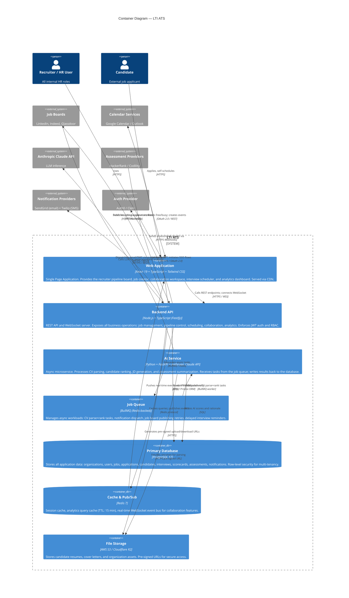

# C4 Architecture Diagrams: LTI — Next-Generation Applicant Tracking System

These diagrams describe the LTI system architecture at three levels of abstraction: the system in its external context, its major deployable containers, and the internal components of the Backend API — the most complex container.

---

## Level 1: System Context Diagram

Shows LTI as a black box interacting with external users and third-party systems. This is the entry-level view for executive stakeholders and non-technical audiences.

---

## Level 2: Container Diagram

Zooms into LTI's internal architecture to show the major deployable units — frontend, backend API, AI service, queues, databases, and storage — and how they communicate.

---

## Level 3: Component Diagram — Backend API

Zooms into the Backend API container to show its internal modules, their responsibilities, and how they interact with each other and with infrastructure dependencies.

```mermaid
C4Component
    title Component Diagram — Backend API (Node.js / Fastify)

    Container_Boundary(api, "Backend API") {
        Component(router, "API Router", "Fastify routes", "Defines all REST endpoints and WebSocket handlers. Routes requests to the appropriate module controller after applying middleware.")

        Component(authMiddleware, "Auth & RBAC Middleware", "TypeScript / JWT", "Verifies JWT access tokens on every request. Enforces role-based access control rules before reaching controllers. Writes to audit log on data access.")

        Component(jobsModule, "Jobs Module", "TypeScript", "Handles job CRUD, status transitions (draft → open → closed), and publication orchestration. Enqueues multi-channel publish tasks.")

        Component(pipelineModule, "Pipeline Module", "TypeScript", "Controls application lifecycle: stage transitions, state machine validation (prevents illegal jumps), and duplicate candidate detection.")

        Component(schedulingModule, "Scheduling Module", "TypeScript", "Reads panel calendar availability, generates proposed slots, confirms candidate-selected slots, creates calendar events, and queues reminder notifications.")

        Component(collabModule, "Collaboration Module", "TypeScript + WebSocket", "Manages ApplicationNote creation, @mention parsing, and real-time event publishing to Redis pub/sub for connected WebSocket clients.")

        Component(notifModule, "Notification Module", "TypeScript", "Translates domain events (stage change, @mention, interview confirmed) into SendGrid/Twilio dispatch tasks and enqueues them into BullMQ.")

        Component(analyticsModule, "Analytics Module", "TypeScript", "Computes hiring funnel, time-to-hire, source attribution, and diversity aggregations. Reads from the PostgreSQL read replica; results cached in Redis.")

        Component(aiGateway, "AI Gateway", "TypeScript", "Facade for all AI operations: exposes synchronous JD generation and bias detection (direct Claude API call) and asynchronous CV parse+rank task enqueueing.")

        Component(webhookHandler, "Webhook Handler", "TypeScript", "Receives inbound webhooks from job boards (new applications) and assessment providers (results). Validates signatures and dispatches to Pipeline or Assessment modules.")

        Component(domainModels, "Domain Models & Business Rules", "TypeScript classes", "Pure domain objects: Job, Application, Candidate, Interview, Scorecard, etc. Encapsulates business invariants and validation rules.")

        Component(repositories, "Repositories", "TypeScript / Prisma ORM", "Data access layer. Executes parameterized SQL via Prisma. Implements query optimization (indexed lookups) and row-level tenant isolation.")
    }

    ContainerDb(postgres, "PostgreSQL", "Primary + Read Replica")
    ContainerDb(redis, "Redis", "Cache + Pub/Sub")
    Container(jobQueue, "BullMQ Queue", "Async task queue")
    System_Ext(claudeAPI, "Anthropic Claude API", "LLM inference")
    System_Ext(calendarSvc, "Calendar Services", "Google / Outlook")
    System_Ext(notifProviders, "Notification Providers", "SendGrid / Twilio")

    Rel(router, authMiddleware, "All requests pass through")
    Rel(authMiddleware, jobsModule, "Routes to module after auth")
    Rel(authMiddleware, pipelineModule, "Routes to module after auth")
    Rel(authMiddleware, schedulingModule, "Routes to module after auth")
    Rel(authMiddleware, collabModule, "Routes to module after auth")
    Rel(authMiddleware, analyticsModule, "Routes to module after auth")
    Rel(authMiddleware, aiGateway, "Routes to module after auth")
    Rel(router, webhookHandler, "Unauthenticated inbound webhooks")

    Rel(jobsModule, aiGateway, "Requests JD generation + bias detection")
    Rel(jobsModule, domainModels, "Uses Job domain model")
    Rel(jobsModule, repositories, "Persists jobs and publications")
    Rel(jobsModule, jobQueue, "Enqueues publish tasks")

    Rel(pipelineModule, domainModels, "Uses Application + Candidate models")
    Rel(pipelineModule, repositories, "Persists applications + stage changes")
    Rel(pipelineModule, notifModule, "Triggers stage-change notifications")
    Rel(pipelineModule, aiGateway, "Enqueues CV parse+rank tasks")

    Rel(schedulingModule, calendarSvc, "Reads availability + creates events")
    Rel(schedulingModule, repositories, "Persists interview records")
    Rel(schedulingModule, notifModule, "Queues reminders + confirmations")

    Rel(collabModule, repositories, "Persists ApplicationNotes")
    Rel(collabModule, redis, "Publishes real-time events")
    Rel(collabModule, notifModule, "Triggers @mention notifications")

    Rel(notifModule, jobQueue, "Enqueues email/SMS dispatch tasks")
    Rel(notifModule, notifProviders, "Workers call SendGrid / Twilio")

    Rel(analyticsModule, repositories, "Reads from read replica")
    Rel(analyticsModule, redis, "Caches aggregated results")

    Rel(aiGateway, claudeAPI, "Direct call for JD generation (sync)")
    Rel(aiGateway, jobQueue, "Enqueues CV parse+rank (async)")

    Rel(webhookHandler, pipelineModule, "Dispatches new application from job board")
    Rel(webhookHandler, repositories, "Persists assessment results")

    Rel(repositories, postgres, "Reads / Writes via Prisma")
```

---

## Notes & Assumptions

- **Modular monolith for v1**: All modules deploy as a single Node.js process. The bounded context boundaries (Jobs, Pipeline, Scheduling, Collaboration, Notifications, Analytics) are designed so that each module can be extracted into an independent service in v2 without refactoring the domain models or repositories.
- **AI Service isolation**: The Python AI Service is a separate deployable process from day one due to language (Python for ML tooling) and independent scaling needs (GPU/LLM latency). It communicates only via BullMQ tasks (async) and direct Claude API for synchronous JD generation is fronted by the aiGateway component to keep the calling contract stable.
- **Read replica**: The Analytics Module targets the PostgreSQL read replica exclusively to prevent OLAP queries from impacting OLTP performance. This is enforced at the repository layer with a separate Prisma client instance pointing to the replica.
- **WebSocket relay**: Real-time collaboration events flow: Collaboration Module → Redis pub/sub → API WebSocket handler → connected Frontend clients. Redis acts as the message bus so that multiple API replicas can relay events to all connected clients regardless of which replica they are connected to.
- **Webhook signature validation**: The Webhook Handler verifies HMAC-SHA256 signatures for all inbound webhooks (job board applications, assessment results) before processing. Unverified payloads are rejected with 401 and logged.
- **Multi-tenancy**: Row-level tenant isolation is enforced in the Repositories via a `WHERE organization_id = $current_org` clause injected by a Prisma middleware extension, ensuring no cross-tenant data leakage even if the API layer is bypassed.
