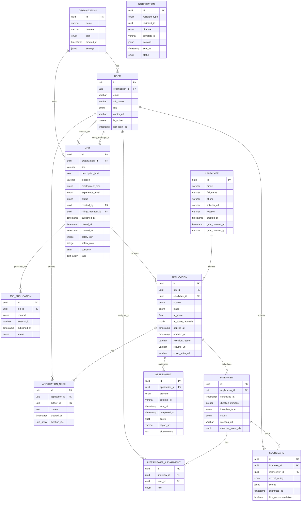

# Entity-Relationship Diagram: LTI — Next-Generation Applicant Tracking System

## Overview

This ER diagram covers all eleven core entities of the LTI data model as defined in the PRD. The model is centred on the `Application` entity, which is the primary operational record connecting a `Candidate` to a `Job` and acting as the root of all downstream activity (interviews, scorecards, assessments, notes, and notifications). Multi-tenancy is anchored at the `Organization` level.

## ER Diagram

## Entity Descriptions

### ORGANIZATION
- **Description**: Root multi-tenancy anchor. Every data record belongs to an organization. Isolates all customer data.
- **Key Fields**: `plan` (starter/growth/enterprise) drives feature access; `settings` (JSONB) stores org-specific configuration (notification templates, RBAC overrides).
- **Relationships**: Parent of User and Job; all tenant-scoped queries filter on `organization_id`.
- **Constraints**: `domain` is unique per organization; used for SSO team matching.

### USER
- **Description**: Any authenticated person in LTI — recruiter, hiring manager, interviewer, HR director, or admin.
- **Key Fields**: `role` determines RBAC access; `is_active` enables soft-delete without losing audit history.
- **Relationships**: Belongs to Organization; can be `created_by` or `hiring_manager_id` on a Job; authors ApplicationNotes; assigned to Interviews via InterviewerAssignment; submits Scorecards.
- **Constraints**: `email` is unique across the system (not just per org) to support SSO identity matching.

### JOB
- **Description**: A job requisition from draft through to closure. The central entity for the sourcing phase.
- **Key Fields**: `status` (draft/open/paused/closed) drives workflow; `ai_score_rationale` on Application is derived from job `tags` and description; `salary_min/max` stored in minor units (cents).
- **Relationships**: Belongs to Organization; has many JobPublications (one per channel) and Applications.
- **Constraints**: `hiring_manager_id` must be a User in the same Organization with role `hiring_manager` or higher.

### JOB_PUBLICATION
- **Description**: Tracks the state of a job on a specific external channel. One record per channel per job.
- **Key Fields**: `external_id` is the job board's identifier (needed for updates and deletions); `status` allows retry logic for failed publications.
- **Relationships**: Belongs to Job.
- **Constraints**: Unique constraint on `(job_id, channel)` — one active publication per channel per job.

### CANDIDATE
- **Description**: A unique person who has applied for at least one job. Shared across organizations (a candidate can apply to multiple companies using LTI).
- **Key Fields**: `gdpr_consent_at` and `gdpr_consent_ip` are mandatory for GDPR compliance; erasure anonymizes all PII fields and replaces `id` with a hashed token in Application records.
- **Relationships**: Has many Applications (one per job applied to).
- **Constraints**: `email` is globally unique; used for duplicate detection across applications.

### APPLICATION
- **Description**: The core operational record — the link between a Candidate and a Job, tracking the full pipeline lifecycle. This is the most-read entity in the system.
- **Key Fields**: `stage` (state machine: applied → screening → phone_screen → assessment → interview → offer → hired/rejected/withdrawn); `ai_score` (0–100 float) and `ai_score_rationale` (JSONB) are populated asynchronously by the AI Service.
- **Relationships**: Belongs to Job and Candidate; has many ApplicationNotes, Interviews, and Assessments.
- **Constraints**: Unique constraint on `(job_id, candidate_id)` — one application per candidate per job. Stage transitions validated by state machine in Pipeline Module.

### APPLICATION_NOTE
- **Description**: A timestamped, attributed comment on an application profile. Supports the real-time collaboration feature.
- **Key Fields**: `mention_ids` (UUID array) stores IDs of @mentioned users; used to trigger targeted notifications.
- **Relationships**: Belongs to Application; authored by a User.
- **Constraints**: `content` must be non-empty; `author_id` must have access to the application's organization.

### INTERVIEW
- **Description**: A scheduled interview session attached to an application. One application may have multiple interviews (phone screen, panel, final).
- **Key Fields**: `calendar_event_ids` (JSONB) stores provider-specific event IDs keyed by user `{userId: eventId}` for targeted deletion on reschedule; `meeting_url` is the video call link.
- **Relationships**: Belongs to Application; has many InterviewerAssignments and Scorecards.
- **Constraints**: `scheduled_at` must be in the future at creation time; `status` transitions: scheduled → completed/cancelled/rescheduled.

### INTERVIEWER_ASSIGNMENT
- **Description**: Join table linking an Interview to the Users participating as panel members.
- **Key Fields**: `role` (lead/panelist/observer) determines whether scorecard submission is mandatory.
- **Relationships**: Belongs to Interview and User.
- **Constraints**: Unique constraint on `(interview_id, user_id)` — a user can only be assigned once per interview.

### SCORECARD
- **Description**: Structured post-interview feedback from one interviewer. Aggregated in the debrief view.
- **Key Fields**: `overall_rating` (strong_yes/yes/neutral/no/strong_no) is the hire-readiness signal; `scores` (JSONB) is an array of `{ criteria: string, rating: 1-5, comment: string }` objects; `hire_recommendation` is the binary decision input.
- **Relationships**: Belongs to Interview; submitted by a User (interviewer).
- **Constraints**: One scorecard per `(interview_id, interviewer_id)` — unique constraint enforced. `submitted_at` is set server-side on first save; cannot be updated after 24h (configurable).

### ASSESSMENT
- **Description**: A technical or cognitive test dispatched to a candidate via a third-party provider and its results.
- **Key Fields**: `provider` identifies the integration; `external_id` links to the provider's assessment record; `ai_summary` is Claude-generated plain-language interpretation of the results.
- **Relationships**: Belongs to Application.
- **Constraints**: `score` is provider-normalized (0–100); raw provider data stored as event log, not in this table.

### NOTIFICATION
- **Description**: A record of every outbound communication (email, SMS, in-app) sent by the system. Used for delivery tracking, retry logic, and audit.
- **Key Fields**: `recipient_type` (candidate/user) + `recipient_id` replaces a FK to two tables; `payload` (JSONB) holds template merge variables for debugging.
- **Relationships**: Loosely linked to Candidate or User via `recipient_id` (polymorphic); not FK-enforced to allow erasure of Candidate records without cascading notification deletion.
- **Constraints**: `status` lifecycle: queued → sent → delivered/failed. Failed notifications are retried via queue with exponential backoff.

## Data Validation Rules

1. `Application.stage` transitions must follow the allowed state machine: `applied → screening → phone_screen → assessment → interview → offer → hired | rejected | withdrawn`. Direct jumps (e.g., `applied → hired`) are rejected by the Pipeline Module.
2. `Job.salary_min` must be ≤ `Job.salary_max` when both are provided.
3. `Candidate.email` must match RFC 5322 format; validated at API boundary.
4. `Scorecard.submitted_at` is set server-side at first submission; client-supplied values are ignored.
5. `InterviewerAssignment` must reference a User in the same Organization as the Job.
6. `Application.ai_score` is in range [0, 100]; values outside this range from the AI Service are clamped and logged as anomalies.
7. `Notification.recipient_id` must reference an existing Candidate or User at the time of creation (soft-validated via application logic, not DB FK, to allow future GDPR erasure).

## Notes & Assumptions

- **Polymorphic recipient on Notification**: The `(recipient_type, recipient_id)` pattern is used instead of two separate FK columns to simplify the erasure pipeline — when a Candidate is erased, Notification rows are anonymized in the same batch without FK cascade complications.
- **JSONB usage**: `ai_score_rationale`, `scores`, `calendar_event_ids`, `payload`, and `settings` use JSONB for flexibility in evolving schemas without migrations. Indexed JSONB paths will be added for frequently queried keys (e.g., `ai_score_rationale->>'top_skills'`).
- **No `updated_at` on all tables**: Only `Application` carries `updated_at` as a pipeline activity marker. Other entities use immutable append patterns (notes, scorecards) or carry their own lifecycle timestamps (`published_at`, `submitted_at`).
- **Cascade strategy**: Deleting an Organization is a hard admin operation with a separate erasure pipeline, not a DB `ON DELETE CASCADE`, to prevent accidental mass data loss. Job and Application deletions within an active org are soft-deleted (status flag), not hard-deleted.
- **Assessment score normalization**: Providers return scores on different scales (0–100, 0–10, letter grades). The AI Service normalizes all scores to [0, 100] before writing to `Assessment.score`; the original provider payload is stored in an append-only event log for audit.
