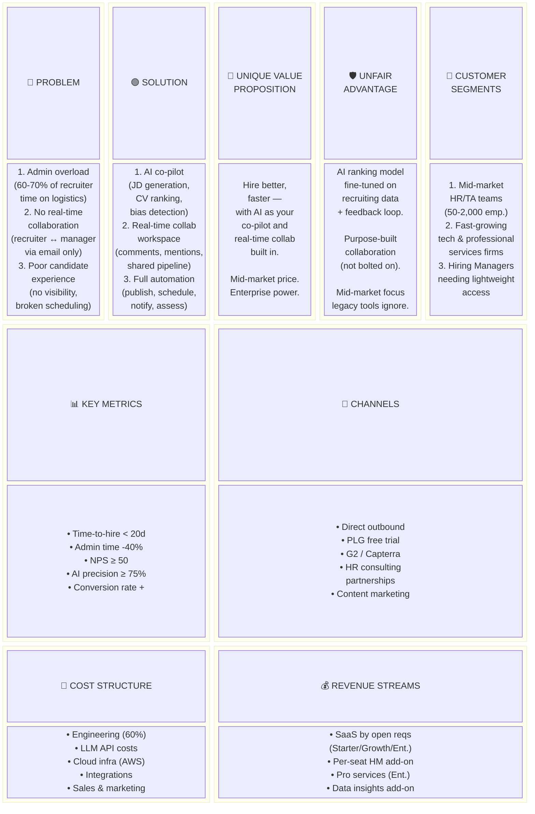

# Lean Canvas: LTI — Next-Generation Applicant Tracking System

## Overview

The Lean Canvas below captures LTI's business model on a single page: the core problems being solved for HR teams, the AI-first solutions offered, the unique value proposition that differentiates LTI from legacy ATS tools, and the revenue and cost structure that make the business viable.

## Lean Canvas Table

| **Problem** | **Solution** | **Unique Value Proposition** | **Unfair Advantage** | **Customer Segments** |
|---|---|---|---|---|
| 1. HR teams spend 60–70% of time on admin (CV parsing, scheduling, status emails) | 1. AI co-pilot: JD generator, CV ranker, bias detector | **Hire better, faster — with AI as your co-pilot and real-time collaboration built in** | Deep AI integration from day one (not bolted-on); purpose-built collaboration model; mid-market pricing with enterprise-grade features | 1. Mid-market companies (50–2,000 employees) with a dedicated recruiter |
| 2. No real-time collaboration between recruiters and hiring managers — everything over email | 2. Real-time collaboration workspace (comments, @mentions, shared pipeline views) | | Proprietary AI ranking model fine-tuned on recruiting data; feedback loop from recruiter overrides | 2. Fast-growing tech & professional services companies actively scaling headcount |
| 3. Slow, broken candidate experience (no status visibility, clunky scheduling) | 3. Automated pipeline: multi-board publish, self-scheduling, stage notifications | | | 3. Hiring Managers who need lightweight input access without ATS training |

| **Key Metrics** | **Channels** |
|---|---|
| 1. Time-to-hire (target: < 20 days avg) | 1. Direct outbound sales to HR Directors and Heads of People |
| 2. Recruiter admin time reduction (target: ≥ 40%) | 2. Product-led growth: free trial → paid conversion via usage milestones |
| 3. Customer NPS (target: ≥ 50) | 3. HR tech marketplace listings (G2, Capterra, Software Advice) |
| 4. AI ranking precision (target: ≥ 75% top-5 accuracy) | 4. Partnerships with HR consulting firms and staffing agencies |
| 5. Pipeline-to-hire conversion rate improvement | 5. Content marketing: recruiting efficiency benchmarks, AI in HR blog |

| **Cost Structure** | **Revenue Streams** |
|---|---|
| 1. Engineering team salaries (primary cost — ~60% of OpEx) | 1. SaaS subscription: tiered by active open requisitions (Starter / Growth / Enterprise) |
| 2. LLM API costs (Anthropic Claude API — scales with usage) | 2. Per-seat add-on for extended Hiring Manager access (post-MVP) |
| 3. Cloud infrastructure (AWS ECS, RDS, ElastiCache, S3) | 3. Implementation & onboarding professional services for enterprise tier |
| 4. Third-party integrations (SendGrid, Twilio, calendar APIs) | 4. Data insights add-on: benchmarking reports using anonymized aggregate data |
| 5. Sales & marketing (outbound, content, HR events) | |

## Lean Canvas Diagram

## Notes & Assumptions

- **Pricing model open question**: PRD Q2 flags that per-seat vs. per-requisition vs. company-size tiering is unresolved. The canvas assumes per-open-requisition as the primary model based on HR team purchasing patterns, but this needs validation with early customers.
- **AI cost sensitivity**: LLM API costs (Anthropic Claude) are usage-variable and could compress margins at scale without caching and batching strategies already outlined in the NFR section.
- **Unfair advantage durability**: The feedback-loop-based AI ranking model strengthens over time per customer, creating switching costs — but only once a sufficient number of hiring decisions have been logged (cold-start risk per R-003 in the PRD).
- **Channel mix**: Product-led growth via free trial assumes a self-serve onboarding flow not explicitly scoped in MVP; this should be added to the Release 1.5 backlog if PLG is the primary acquisition channel.
