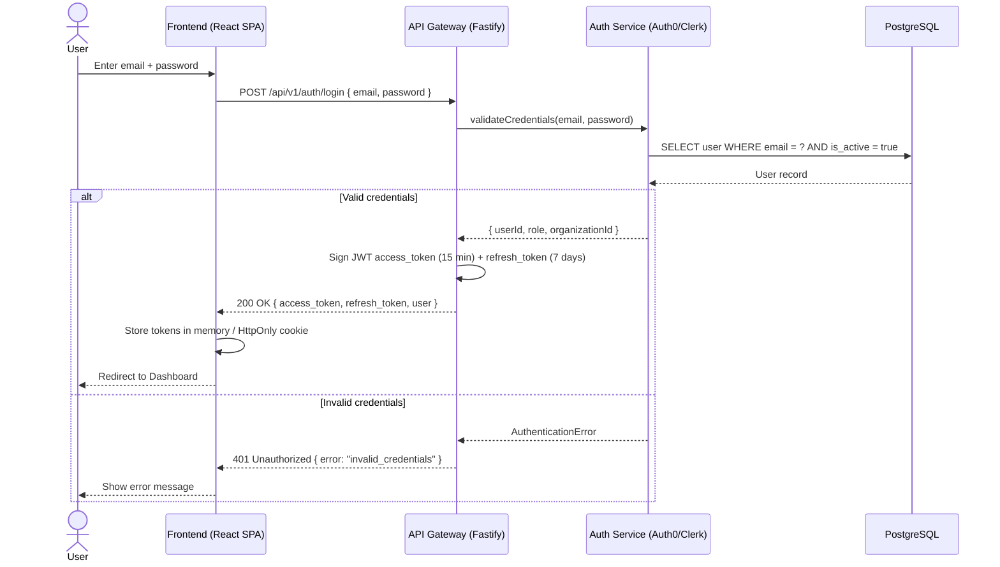
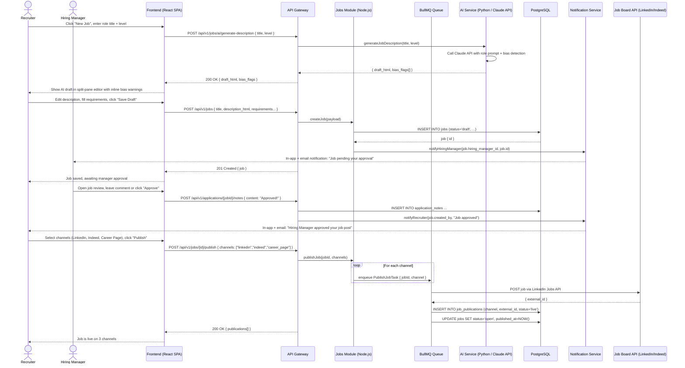
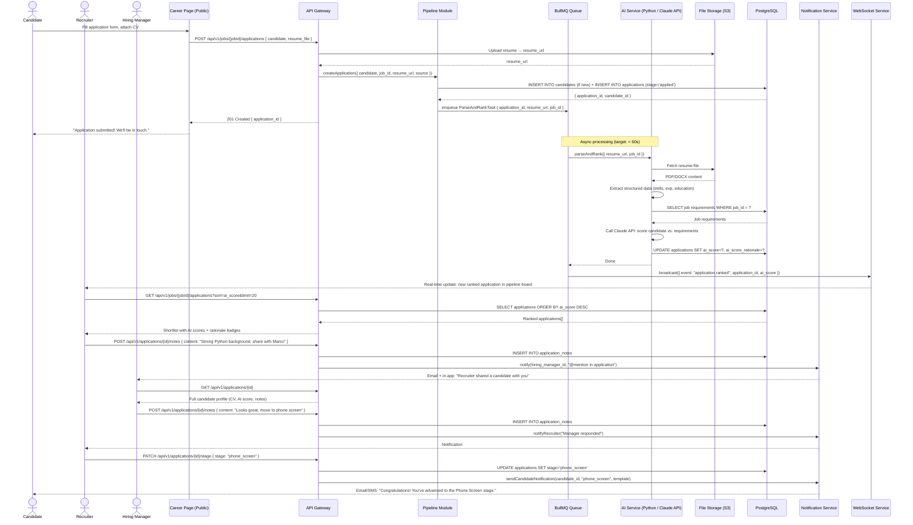
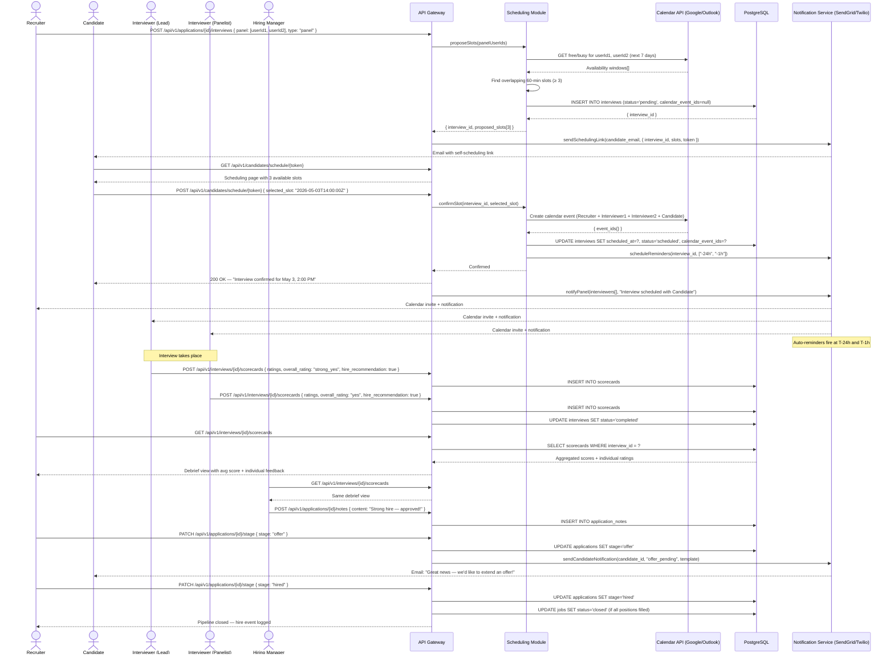
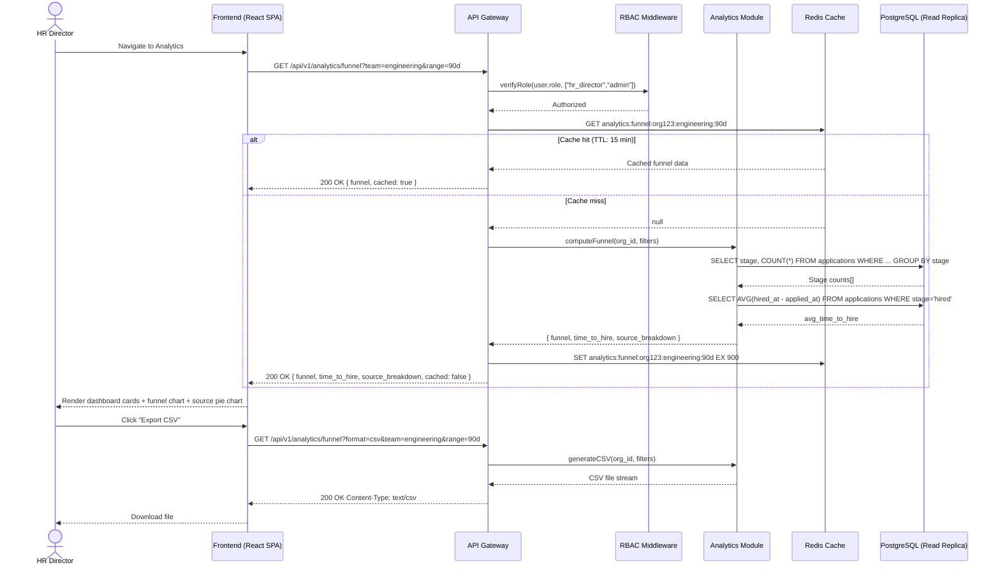

# Sequence Diagrams: LTI — Next-Generation Applicant Tracking System

These diagrams cover the three primary business flows from the PRD use cases, plus authentication. Each diagram traces the full interaction across actors, frontend, API, services, and external systems.

---

## 1. User Authentication Flow

JWT-based authentication with short-lived access tokens and refresh token rotation. SSO via SAML/OIDC is an alternative path for enterprise customers handled by Auth0/Clerk.

---

## 2. Job Creation & AI-Assisted Publication Flow (Use Case 1)

Covers job drafting with AI JD generation, hiring manager approval via in-platform collaboration, and multi-channel job board publishing.

---

## 3. Candidate Screening & AI Ranking Flow (Use Case 2)

Covers application submission, asynchronous CV parsing + AI ranking, and recruiter/manager collaboration on the shortlist.

---

## 4. Interview Scheduling & Hire Decision Flow (Use Case 3)

Covers automated panel availability check, candidate self-scheduling, scorecard collection, debrief, and final hire decision.

---

## 5. HR Analytics Dashboard Load Flow (Use Case 17)

Covers an HR Director loading the analytics dashboard with server-side aggregation, caching, and filtered results.

---

## Notes & Assumptions

- All sequence diagrams assume TLS 1.3 in transit for all HTTP calls; not annotated on every arrow for readability.
- The async CV parsing flow (Flow 3) uses BullMQ + WebSocket push to avoid polling. If WebSocket connection is unavailable, the frontend falls back to polling `GET /applications/{id}` every 10s.
- Calendar API calls in Flow 4 assume OAuth tokens are pre-authorized during organization setup (Settings → Integrations). Expired OAuth tokens trigger a re-authorization prompt to the Recruiter.
- Reminder notifications in Flow 4 are queued as delayed BullMQ jobs at the time the interview is confirmed, not at the reminder fire time. This avoids cron dependencies.
- Analytics cache TTL of 15 minutes (900s) is a starting assumption; this should be tunable per organization size and dashboard refresh expectations.
- PATCH `/applications/{id}/stage` is the single endpoint driving all pipeline stage transitions; it internally validates allowed transitions (e.g., cannot jump from `applied` directly to `hired`) using a state machine in the Pipeline Module.
