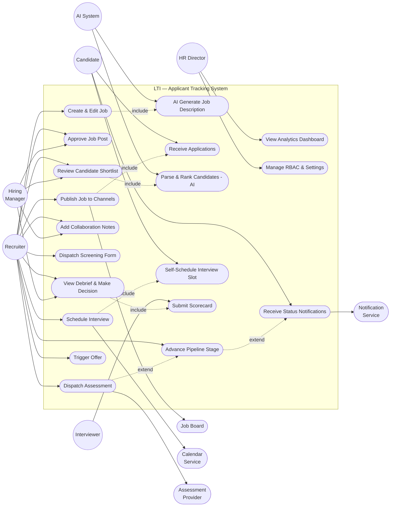

# Use Case Diagram: LTI — Next-Generation Applicant Tracking System

## Overview

This diagram maps every primary actor in the LTI platform to the use cases they participate in, showing include and extend relationships between system functions. The system boundary encloses all LTI-managed functionality; external actors interact from outside that boundary.

## Actors

- **Recruiter**: Core HR user who owns the end-to-end recruiting workflow — creates jobs, screens candidates, schedules interviews, and drives hiring decisions.
- **Hiring Manager**: Collaborates on job approval, candidate shortlist review, interview scheduling, and final hire authorization.
- **Interviewer**: Panel member who participates in interviews and submits structured scorecards.
- **HR Director**: Strategic observer with analytics access; manages system configuration and RBAC policies.
- **Candidate**: External applicant who submits an application, completes assessments, and self-schedules interviews.
- **AI System**: Internal automated actor that parses CVs, generates job descriptions, ranks candidates, and summarizes assessments.
- **Job Board (LinkedIn/Indeed/Glassdoor)**: External system that receives published jobs and returns incoming applications.
- **Calendar Service (Google/Outlook)**: External system queried for panel availability and used to create calendar events.
- **Assessment Provider (HackerRank/Codility)**: External system that delivers and scores technical assessments.
- **Notification Service (SendGrid/Twilio)**: External system that delivers email and SMS communications to candidates and users.

## Use Case Diagram

## Use Case Descriptions

### UC1: Create & Edit Job
- **Actor**: Recruiter
- **Preconditions**: Recruiter is authenticated; job requisition is internally approved
- **Main Flow**: Recruiter opens "New Job", fills in title/level/location/requirements; AI co-pilot (UC2) drafts description automatically
- **Postconditions**: Job is saved in Draft status; ready for manager approval
- **Linked User Stories**: US-001, US-002

### UC2: AI Generate Job Description
- **Actor**: AI System (triggered by UC1)
- **Preconditions**: Role title and seniority level provided
- **Main Flow**: LLM generates structured JD draft; bias detection flags gender-coded or exclusive language inline
- **Postconditions**: Draft inserted into job form; recruiter can edit freely
- **Linked User Stories**: US-001

### UC3: Approve Job Post
- **Actor**: Hiring Manager (primary), Recruiter (receives outcome)
- **Preconditions**: Job is in Draft status; Hiring Manager notified in-platform
- **Main Flow**: Manager reviews JD; leaves comments or approves; Recruiter is notified
- **Postconditions**: Job status transitions to Approved; Recruiter can publish
- **Linked User Stories**: US-003

### UC4: Publish Job to Channels
- **Actor**: Recruiter
- **Preconditions**: Job is Approved
- **Main Flow**: Recruiter selects channels (career page, LinkedIn, Indeed, Glassdoor); system publishes simultaneously and attaches source UTM tags
- **Postconditions**: Job is Live on selected channels; JobPublication records created
- **Linked User Stories**: US-002

### UC5: Receive Applications
- **Actor**: Candidate (submits), Job Board (delivers)
- **Preconditions**: Job is published on at least one channel
- **Main Flow**: Candidate submits via career page or job board; Application record created with source tag; CV stored in S3
- **Postconditions**: Application in `applied` stage; AI parsing queued (UC6)
- **Linked User Stories**: US-008

### UC6: Parse & Rank Candidates (AI)
- **Actor**: AI System
- **Preconditions**: Application CV received and stored
- **Main Flow**: AI extracts structured data (skills, experience, education); scores candidate against job requirements; stores `ai_score` and `ai_score_rationale`
- **Postconditions**: Candidate appears in ranked shortlist; recruiter can override
- **Linked User Stories**: US-004

### UC7: Review Candidate Shortlist
- **Actor**: Recruiter (primary), Hiring Manager (collaborator)
- **Preconditions**: Applications are in the pipeline; AI scores available
- **Main Flow**: Recruiter opens Pipeline Board; reviews AI-ranked list; shares view with Hiring Manager; both can leave notes (UC8)
- **Postconditions**: Candidates are accepted or rejected; accepted advance to next stage (UC9)
- **Linked User Stories**: US-003, US-004

### UC8: Add Collaboration Notes
- **Actor**: Recruiter, Hiring Manager
- **Preconditions**: User has access to the application profile
- **Main Flow**: User types note in comment thread; @mention triggers notification to mentioned user; note is timestamped and attributed
- **Postconditions**: Note stored in ApplicationNote; all collaborators notified
- **Linked User Stories**: US-003

### UC9: Advance Pipeline Stage
- **Actor**: Recruiter
- **Preconditions**: Candidate is in any non-terminal stage
- **Main Flow**: Recruiter selects new stage; stage update recorded; automated notification triggered (UC19)
- **Postconditions**: Application.stage updated; candidate notified; analytics event logged
- **Linked User Stories**: US-008, US-009

### UC10: Dispatch Screening Form
- **Actor**: Recruiter
- **Preconditions**: Candidate is in `screening` stage
- **Main Flow**: Recruiter selects screening form template; system sends link to candidate; responses stored and AI-summarized
- **Postconditions**: Screening responses visible on candidate profile
- **Linked User Stories**: US-009

### UC11: Dispatch Assessment
- **Actor**: Recruiter
- **Preconditions**: Candidate is in `assessment` stage; assessment provider integrated
- **Main Flow**: Recruiter selects assessment type; system sends invitation via provider API; candidate completes test; results ingested via webhook; AI generates summary
- **Postconditions**: Assessment results and AI summary visible on candidate profile
- **Linked User Stories**: US-011

### UC12: Schedule Interview
- **Actor**: Recruiter
- **Preconditions**: Candidate passed screening; interview panel defined
- **Main Flow**: System queries panel calendars for overlapping availability; proposes ≥ 3 slots; recruiter sends self-scheduling link to candidate (UC13); calendar events auto-created upon candidate selection
- **Postconditions**: Interview record created; reminders queued at 24h and 1h
- **Linked User Stories**: US-005

### UC13: Self-Schedule Interview Slot
- **Actor**: Candidate
- **Preconditions**: Candidate received scheduling link; slots available
- **Main Flow**: Candidate opens scheduling page (token-authenticated); selects preferred slot; system confirms and creates calendar events for all parties
- **Postconditions**: Interview.status = scheduled; all participants receive calendar invite
- **Linked User Stories**: US-005

### UC14: Submit Scorecard
- **Actor**: Interviewer
- **Preconditions**: Interview is completed; scorecard template assigned
- **Main Flow**: Interviewer opens scorecard form; rates each criterion; adds free-text comments; submits overall recommendation
- **Postconditions**: Scorecard stored; debrief view (UC15) updated with new score
- **Linked User Stories**: US-006

### UC15: View Debrief & Make Decision
- **Actor**: Recruiter, Hiring Manager
- **Preconditions**: All interviewers have submitted scorecards
- **Main Flow**: Recruiter and Hiring Manager view aggregated scorecard results; discuss in-platform; Hiring Manager approves or rejects hire
- **Postconditions**: Hire decision recorded; pipeline advances to Offer or Rejected
- **Linked User Stories**: US-006, US-003

### UC16: Trigger Offer
- **Actor**: Recruiter
- **Preconditions**: Hire decision is Approved
- **Main Flow**: Recruiter triggers offer; system logs hire event; analytics updated; pipeline closes; onboarding handoff marker set
- **Postconditions**: Application.stage = hired; Job may be closed if all positions filled
- **Linked User Stories**: US-002

### UC17: View Analytics Dashboard
- **Actor**: HR Director
- **Preconditions**: User has hr_director or admin role
- **Main Flow**: Director accesses Analytics section; views funnel, time-to-hire, source effectiveness, and diversity charts; applies filters; exports CSV
- **Postconditions**: No state change; read-only reporting
- **Linked User Stories**: US-007

### UC18: Manage RBAC & Settings
- **Actor**: HR Director, Admin
- **Preconditions**: User has admin role
- **Main Flow**: Admin configures user roles, notification templates, assessment integrations, and calendar connections
- **Postconditions**: Settings persisted; audit log entry created
- **Linked User Stories**: US-010

### UC19: Receive Status Notifications
- **Actor**: Candidate (primary), Users (secondary via @mention)
- **Preconditions**: Stage change or @mention event triggered
- **Main Flow**: Notification service sends email/SMS within 5 min; template rendered with candidate and job merge tags
- **Postconditions**: Notification.status = delivered; candidate informed of current status
- **Linked User Stories**: US-008

## Notes & Assumptions

- The AI System actor is modelled as an internal automated participant, not a human user; it is invoked synchronously (JD generation) and asynchronously (CV parsing/ranking).
- `include` relationships denote mandatory sub-flows that always execute as part of the parent use case.
- `extend` relationships denote optional or conditional extensions (e.g., dispatching an assessment is an extension of stage advancement, not always performed).
- Calendar integration is shown as a dependency of UC12; if unavailable, the system falls back to manual slot entry (alternative flow not shown in the diagram for brevity).
- Open question Q1 (opt-in vs always-on self-scheduling) affects whether UC13 is an `include` or `extend` of UC12 — currently modelled as `include`.
